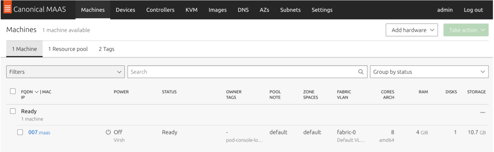

# Build Your Private Cloud over Bare Metal

You will get the full horsepower of the server, and you also have full access to the hardware layer, e.g., BIOS/network adapter driver.

To build a VPC over the Zenlayer bare metal instances, we will perform the following steps:


## **Step 1 - Provision bare metal instances**

1.  [**Spin up a bare metal instance**](../get-started/create-a-bare-metal-instance.md) **** and get IP configured.\
    \
    After the initial provisioning, your instance is assigned with a /30 internet IP address, and this is how it works.


    For example, the CIDR notation `128.14.148.248/30` has 4 IP addresses included, and 2 out of these 4 are usable for hosts. The server will take one while the network switch will take another one as gateway IP:

    * `128.14.148.248` - Network identifier (not used for server)
    * `128.14.148.249` - Gateway
    * `128.14.148.250` - Server’s internet IP address
    * `128.14.148.251` - Broadcast address


2.  Assume that a user chooses the ubuntu 20.04 as the OS and here it is the `ip a` output from console:\


    <figure><figcaption><p><br></p></figcaption></figure>


3.  To build a VPC, the plan is to get one server for the private cloud controller and two servers for the virtual machines, therefore placing the order of 3 bare metal instances and got them running:\


    <figure><figcaption></figcaption></figure>

****

## **Step 2 - Create a VPC and attach instances**

After the initial provisioning, 3 instances are up and running with Internet access. As those 3 instances are still isolated from each other, the next step is to build a private network and bridge all of them. Zenlayer bare metal cloud provides VPC, that is a VLAN/VxLAN, which can help you to achieve this.

<figure><figcaption></figcaption></figure>


1. [**Create a VPC and a subnet**](../get-started/create-a-virtual-private-cloud.md).\

2.  Click **Add Instance** to attach instances to your subnet.\


    <figure><figcaption></figcaption></figure>

    \
    You can get the MAC address of VPC on instance details page, which you may use it for future setup with DHCP IP & MAC binding.\


    <figure><figcaption></figcaption></figure>


<mark style="color:blue;">**Note**</mark>

* <mark style="color:blue;">The page shows</mark> <mark style="color:blue;"></mark><mark style="color:blue;">`pxe 0`</mark> <mark style="color:blue;"></mark><mark style="color:blue;">as Zenlayer uses that same interface for OS installation during the provision when you placed the order, and now they are your private LAN interface.</mark>
* <mark style="color:blue;">You can see the VLAN ID is 1047 in this case. All the Zenlayer bare metal instances' switch ports are set to “access port” so this VLAN ID is for reference purpose in case you are requesting support and may be asked to provide info.</mark>


****

### **Result**

In this case, the hostname and IP address assignment are shown as below:

|   Hostname  | Private IP Address | Private Interface MAC Address |
| :---------: | :----------------: | ----------------------------- |
| Test802Q-01 |     `10.7.7.11`    | 0c:c4:7a:e2:df:42             |
| Test802Q-02 |     `10.7.7.12`    | 0c:c4:7a:e2:db:1a             |
| Test802Q-03 |     `10.7.7.13`    | 0c:c4:7a:e2:e1:a2             |

****\
****With the private network IP address assigned you can ping to each instance to verify the private network is up and running:\


<figure><figcaption></figcaption></figure>


## **Step 3 - Set up the controller server**

To build your own private cloud, a controller server is the key module by making VM commission/deploy/destroy automatic. There are many options vary from commercial software to open-source software, and in this case, MAAS will be taken as an example to build a KVM-based private cloud. The private cloud topology is as below:

* Test802Q-03 server - Controller server with MAAS (control plane)
* Test802Q-02 server - KVM Server 2 (data plane)
* Test802Q-01 server - KVM server 1 (data plane)

<figure><figcaption></figcaption></figure>


1.  See [**MAAS | How to install MAAS**](https://maas.io/docs/how-to-install-maas) to install the MAAS on the Test802Q-03 instance.\


    <figure><figcaption></figcaption></figure>


2. Access the instance via `https://[$server IP]:5240/MAAS/r/dashboard`. For security reason, block the Internet access of MAAS GUI port, and make an SSH tunnel port forwarding so that access to the GUI with the URL [http://127.0.0.1:5240/MAAS/r/dashboard](http://127.0.0.1:5240/MAAS/r/dashboard) is allowed.\

3.  Enable DHCP service\
    \
    Go to **Subnets** tab and enable DHCP service on the LAN interface (`fabric-0` in this case). Check **MAAS provides DHCP** and set the IP range accordingly ( `10.7.7.x/24` in this case).\


    <figure><figcaption></figcaption></figure>

    \
    Go back to **Controllers** tab to double confirm DHCP is up and running.\


    <figure><figcaption></figcaption></figure>


4.  MAAS user configuration and upload your SSH public key\
    With the completion of MAAS setup, a user “`maas`“ was created:\


    ```
    root@Test802Q-03:~# cat /etc/passwd | grep maas
    ```

    \
    The output would be like: “`#: maas:x:117:124::/var/lib/maas:/usr/sbin/nologin`”, showing the maas account doesn’t have login shell by default. Instead for managing the KVM/Hypervisor servers, we need to enable the bash/shell for it and create the SSH key for login to the KVM/Hypervisor servers:


    ```
    $: sudo chsh -s /bin/bash maas
    $: sudo su - maas
    $: ssh-keygen -f ~/.ssh/id_rsa -N ''// Some code
    ```

    \
    This will enable the bash and generate RSA key pairs in .ssh subfolder of maas account’s home directory.\


    <figure><figcaption></figcaption></figure>

    \
    We will copy the content of id\_rsa.pub to KVM servers so that maas account can log in to KVM/Hypervisor servers with key authentication.\


    You will be asked to upload another key for deploying servers by MAAS, as there is no default username/pass combo MAAS deploys machines with, the only way you can access your MAAS deployed machines is via SSH public key.\


    <figure><figcaption></figcaption></figure>


5.  NAT configuration\
    \
    For cloud-init similar setup, VMs on the maas libvirt network must be able to reach the wider network. Either of the following conditions should be met:

    * The bridge the VMs are attached to must include one of the host’s physical network interfaces on the appropriate network;
    * NAT must be enabled.&#x20;

    \
    In this case the user uses NAT approach and sets the gateway to 10.7.7.13, which is the MAAS server’s IP. The command below is for your reference:\


    ```
    vim /etc/sysctl.conf
    net.ipv4.ip_forward = 1
    sysctl -p
    ```

    \
    The upper settings will enable the IP forward of the host, then you can create NAT rules. The command line options are vary from firewall-cmd to iptables, this is an example of using firewall-cmd:\


    ```
    #Use firewall-cmd for NAT,define zone with firewall-cmd
    firewall-cmd --permanent --zone=external --change-interface=wan0
    firewall-cmd --permanent --zone=internal --change-interface=lan0
    #set NAT masquerade
    firewall-cmd --zone=external --add-masquerade --permanent
    #NAT rules
    firewall-cmd --permanent --direct --passthrough ipv4 -t nat -I POSTROUTING -o em1 -j MASQUERADE -s 10.7.7.0/24
    firewall-cmd --reload
    ```


    Alternatively, a simple line of iptables will do the job too:


    ```
    iptables -t nat -A POSTROUTING -o wan0 -j MASQUERADE
    ```



<mark style="color:blue;">**Note**</mark>

* <mark style="color:blue;">Zenlayer bare metal cloud doesn’t provide direct access to the instances' IPMI, therefore you cannot use IPMI interface call to manage instances.</mark>
* <mark style="color:blue;">All the Zenlayer bare metal instances have the PXE boot enabled on LAN interface, which is the default BIOS settings. After the OS installation, the LAN interfaces are repurposed as instances' “private interface“ for users.</mark>



<mark style="color:green;">**Tip**</mark>\ <mark style="color:green;">You can bring up one instance with PXE installed and make it listening on the private VLAN, which will be your controller, then order the any other instances with “No OS“ option. Connecting the instances' private interfaces to your PXE connected VPC/VLAN, and triggering a reboot, the instances will start a PXE booting as the private interface is set as first boot option by default. This could be regarded as your own “bare metal level PXE OS installation“ .</mark>


****

## **Step 4 - Configure the hypervisor servers**

You can deploy a new KVM server by checking **Register as MAAS-managed KVM Host** for a MAAS managed bare metal instance. See [**Add a KVM host**](https://github.com/CanonicalLtd/maas-docs/blob/master/en/manage-kvm-add-host.md) for details.

While in this case, the OS has been installed with Zenlayer console, and this is a proof-of-concept type build, so a manual way needs to be explained.


1.  Install the qemu-kvm with a command line:\


    ```
    sudo apt install bridge-utils qemu-kvm libvirt-bin
    ```

    \
    This is the original `ip a` output:\
    lo/lan0/wan0 are for the bare metal servers loopback/LAN/WAN interface.\


    <figure><figcaption></figcaption></figure>


2.  Configure the bridge settings\
    \
    The `brctl show` output shows the virbr0 is the default bridge created by KVM, and the interface named `virbr0-inc` is bridged.\


    <figure><figcaption></figcaption></figure>

    \
    Assume the user wants to bridge the VM’s interface to the host (hypervisor)'s LAN interface, then the VM can get the IP address assigned by MAAS server’s DHCP (`10.7.7.x/24` subnet). Change is also required in the KVM default network settings to make sure any new VM will use this bridge:\


    <figure><figcaption></figcaption></figure>


    ```
    brctl addif  virbr0 lan0
    ip addr delete 10.7.7.11/24 dev lan0
    ip addr add 10.7.7.11/24 dev virbr0
    ```

    \
    This will remove the original IP from lan0 to virbr0. Run the brctl to confirm the lan0 is added to virbr0:\


    <figure><figcaption></figcaption></figure>

    \
    The following `ip a` command is to verify the IP address settings:\


    <figure><figcaption></figcaption></figure>


3.  Edit the libvirt default network profile\
    \
    The MAAS first checks for the existence of a libvirt network named maas. The maas network should have DHCP disabled in favor of MAAS-enabled DHCP to allow your VMs to network boot. If MAAS cannot find a maas network, it will fall back to libvirt’s default network.\
    \
    It is important to make the VM network able to communicate with MAAS, which could be done by either creating a maas libvirt network profile or modifying the KVM default network profile. Assume the user chooses to modify the default profile:\


    ```
    virsh net-edit default
    ```

    \
    The original setting has KVM DHCP enabled for subnet 192.168.x.x, as the VM will be bridged with virbr0 to get IP assignment for MAAS DHCP, change it as below:\


    <figure><figcaption></figcaption></figure>


4.  Add MAAS users key for SSH access\
    \
    The SSH access is used by MAAS server for management. To make it easy, grant the root access for maas server by adding the maas account’s public key into the .ssh/authorized\_keys file which locates in the root home folder.\


    <figure><figcaption></figcaption></figure>


<mark style="color:green;">**Tip**</mark>\ <mark style="color:green;">You can add the maas public key to the corresponding account for your libvert KVM management account, if you prefer to have tight restriction on different users' privilege.</mark>



## **Step 5 - Register the hypervisor servers in MAAS**

1.  After adding the maas user's public key to the root authentication of hypervisor, you can run a ssh test to make sure it works:\


    <figure><figcaption></figcaption></figure>


2.  The bash command is the approach that the MAAS server communicates with KVM hypervisors. Make sure it works:\


    ```
    sudo -H -u maas bash -c 'virsh -c qemu+ssh://root@10.7.7.11/system list --all'
    ```

    \
    The `10.7.7.11` is the Test802Q-01 instance’s LAN IP address, and the output would be like:&#x20;


    ```
    Id   Name   State
    ```

    \
    This output is exact the same as running `virsh list --all` on hypervisor, which means the communication between MAAS and Hypervisor (KVM in this case) is working great.\

3.  Register the hypervisor\
    \
    Go to **KVM** tab and register the KVM hypervisor.\


    <figure><figcaption></figcaption></figure>

    \
    In this case, the virsh address is `qemu+ssh://root@10.7.7.11/system`. The MAAS will use the maas account to log in to hypervisors, instead it is mapping to the root account on the hypervisor by adding the public key into `/root/.ssh/authorized_keys`.\
    \
    After the registration, you can choose **Refresh** from **Take action** drop-down menu to retrieve the virsh VM ID or the status of the hypervisor.\


    <figure><figcaption></figcaption></figure>


## **Step 6 - Create and deploy virtual machines**

1.  Compose VM\
    \
    In this case, both 10.7.7.11 and 12 servers are added into the MAAS, you can click on one of them and choose **Compose** from **Take action** drop-down menu to generate your first VM:\


    <figure><figcaption></figcaption></figure>


2.  Deploy VM\
    \
    After the compose stage, the VM will be shut down and ready for deployment. Then you can deploy the server by choosing the OS and set other options (e.g. cloud-init).\


    <figure><figcaption></figcaption></figure>

    \
    You have set up the NAT rule on MAAS server and bridge the VM network into the `10.7.7.x` while using DHCP to set the gateway. By checking the cloud-init option you can let the VM to grab init settings after the initial setup, even your cloud-init metadata server is sitting outside of Zenlayer networks.\


    <figure><figcaption></figcaption></figure>

    \
    \
    During the commission and deployment, you can also enable VNC access to the VM, the screen output would be same as most of the PXE bootings:\


    <figure><figcaption></figcaption></figure>

    \
    This is the final view of all the VMs deployed:\


    <figure><figcaption></figcaption></figure>

    \
    DHCP IPs are assigned for each of VMs. If you execute the `brctl show` command to check the network settings, you will see all the new created vnet0\~2 virtual network adapters are all bridged to virbr0:\


    <figure><figcaption></figcaption></figure>


3.  Log in to VM and verify settings\
    \
    Now your VPC is up and running, the ens3 is the network interface name in VM, while the vnet0\~2 are the interface names for hypervisor:


    <figure><figcaption></figcaption></figure>


<mark style="color:blue;">**Note**</mark>

* <mark style="color:blue;">MAAS enables SSH key login as the only option after an OS deployment of VM. Please upload your SSH key before deploying any server.</mark>
*   <mark style="color:blue;">In this case, Ubuntu is chosen for deployment and the default user will be “ubuntu”, while</mark> <mark style="color:blue;"></mark><mark style="color:blue;">`10.7.7.6`</mark> <mark style="color:blue;"></mark><mark style="color:blue;">is the DHCP assigned IP address for VM 088, which is running over the hypervisor ”Test802Q-02”. Make an SSH login test with the private key pair for MAAS admin:</mark>\ <mark style="color:blue;"></mark>

    <figure><figcaption></figcaption></figure>

    <mark style="color:blue;"></mark>\ <mark style="color:blue;">And the</mark> <mark style="color:blue;"></mark><mark style="color:blue;">`ip r`</mark> <mark style="color:blue;"></mark><mark style="color:blue;">shows the default route is set to MAAS server which is working as an NAT gateway:</mark>\ <mark style="color:blue;"></mark>

    <figure><figcaption></figcaption></figure>

    <figure><figcaption></figcaption></figure>

    <mark style="color:blue;"></mark>
*   <mark style="color:blue;">Another best practice is to re-route the VM’s default gateway to your hypervisor, as Zenlayer bare metal instance has one Internet IP assigned by default, you can utilize the hypervisor’s network for the Internet access of all VMs.</mark>\ <mark style="color:blue;"></mark>\ <mark style="color:blue;">Assume the VM 088 is running over the hypervisor “Test802Q-02”, you can go to Zenlayer console to check its Internet connectivity plan and status. It shows a valid IPv4 address with 10 Mbps flat rate data plan. As the hypervisor’s LAN interface “lan0” is bridged with VM’s interface via “virbr0”, you can create another NAT rule on the Test802Q-02 host to make it work as the gateway for all the VMs running on it, so that the traffic will be balanced between different Zenlayer bare metal instances instead of MAAS NAT gateway.</mark>\ <mark style="color:blue;"></mark>

    <figure><figcaption></figcaption></figure>


****

## **Step 7 - Known issues**

1.  A major concern is that the Zenlayer bare metal instance is set to PXE boot by default, which cannot be changed due to the Zenlayer platform restriction. If you reload the bare metal instance, it will be picked up by MAAS PXE for registration or commission.\
    \
    As this is a proof-of-concept type testing and you use MAAS while its PXE service is enabled by default, another option is to disable the PXE of MAAS and enable it only when you are doing the VM provisioning, or you can configure a block list on your DHCP server to skip the DHCP request from bare metal instance, and the MAAS DHCP settings is for your reference:\


    ```
    class "black-hole" {
    match substring (hardware, 1, 6);
    # deny booting;
    ignore booting;
    }
    subclass "black-hole" 00:12:ba:1d:c1:b5;
    subclass "black-hole" 00:12:df:b6:7b:e1;
    #If you comment out the "ignore booting" and uncomment the "deny booting", it will send an DHCPNAK (IIRC) to the client instead.
    ```


    Also a single line ebtables command with MAC address block list will work too:\


    ```
    ebtables -A INPUT -s 00:11:ba:1d:c1:b5 -j DROP
    ```


2.  You may also encounter some issues during the commissioning of VMs over the MAAS, especially when the VM interface is not assigned to correct bridge. The correct bridge should have bare metal instance’s lan0 included, usually the VM creation will call the default profile and create vnet0/2/3… in that bridge. The solution is to modify the VM profile and change the network interface part:\


    ```
    <interface type='bridge'>
      <mac address='52:54:00:a2:ac:18'/>
      <source bridge='virbr0'/>
      <model type='virtio'/>
      <address type='pci' domain='0x0000' bus='0x00' slot='0x03' function='0x0'/>
    ```


3.  Another case is the default MAAS composed VM uses spice as the graphic option, somehow the VM console is unaccessible via `virsh console [VM name]`, maybe the system lacking some lib. The solution is to switch to VNC.\


    ```
    <graphics type='vnc' port='-1' autoport='yes' listen='127.0.0.1'>
      <listen type='address' address='127.0.0.1'/>
    </graphics>
    <video>
      <model type='qxl' ram='65536' vram='65536' vgamem='16384' heads='1' primary='yes'/>
      <address type='pci' domain='0x0000' bus='0x00' slot='0x02' function='0x0'/>
    </video>
    ```


4. Last issue is more like a reminding — remember to set VNC listening on `127.0.0.1` instead of `0.0.0.0`. As every Zenlayer bare metal instance has one Internet IP by default, making VNC listening on Internet may end up your security being compromised.

