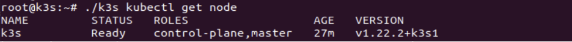
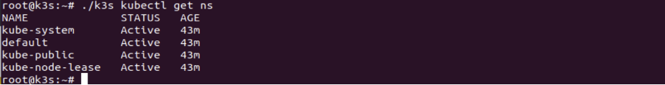

# Start Kubernetes Cluster Using K3S in Bare Metal Cloud

There are many advantages to run containers on top of bare metal instances rather than virtual machine, such as reducing the software stack by removing virtual machine layer, easy network configuration without virtual machine bridging or translations.

Along with the kubernetes, K3S from open source community aims to be deployed as lightweight kubernetes with smaller footprints, running in Intel x86 and ARM CPUs.


## What is K3S?

K3S has the following features:

* Lightweight kubernetes&#x20;
* Single binary (\~50MB)&#x20;
* Low memory/cpu footprint&#x20;
* CNCF certified distro&#x20;
* Designed for production&#x20;
* ARM support&#x20;
* Perfect for the edge

Kubernetes cluster involves a master node and one or more worker nodes. Their functions are as follows:

* **Master** – controls the cluster, API calls, and so on.
* **Workers** – where the pods are deployed and applications ran. They can be added and removed from the cluster on demands.

To setup a k3s cluster, we need at least two hosts, one master node and one worker node. In this example we shall be using two hosts from Zenlayer Bare Metal Cloud (BMC) product.

Zenlayer BMC offers multiple choice of servers types, typically as S/M/L types with variations. In this example, we choose the S type as K3S can also perform well in the 16 G memory configuration.


## Instance Provision

Start [provision an instance](../get-started/create-a-bare-metal-instance.md) on zenConsole

Choose to install Ubuntu 20.04 in the instance, with SSH-key access.

The instance will be ready in couple of minutes and we can access it using keyless SSH access.


## K3S Installation

Go to [K3S.io](https://k3s.io) and download the binary from [here](https://github.com/k3s-io/k3s/releases/download/v1.22.2%2Bk3s1/k3s). Change the file with '`chmod +x k3s`' to make it executable.

* In the master node, run the following commands:

```
sudo k3s server &
# Kubeconfig is written to /etc/rancher/k3s/k3s.yaml.
# check the master node by running:
sudo k3s kubectl get node
```

We should be able to see something as following:

<figure><figcaption><p>Code Result</p></figcaption></figure>

From the master node, find the `NODE_TOKEN` from `/var/lib/rancher/k3s/server/node-token`.

* In the worker node, run the following commands:

```
sudo k3s agent --server https://${Ipaddress_of_master_node}:6443 --token ${NODE_TOKEN}
```

We will see many information logs from both instances. Shortly, we run '`.k3s kubectl get node`' and should be able to see the two nodes are ready. We can run other kubenetes commands from here.

<figure><figcaption><p>Run Kubenetes Commands</p></figcaption></figure>

