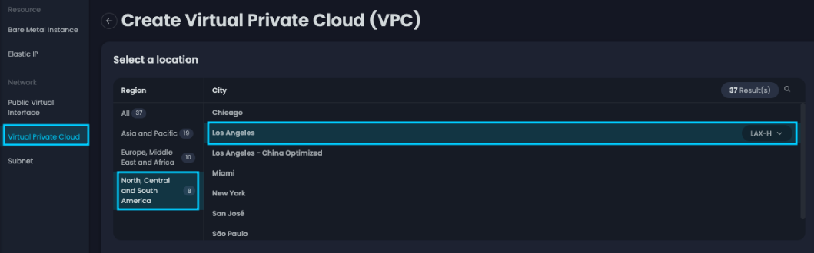
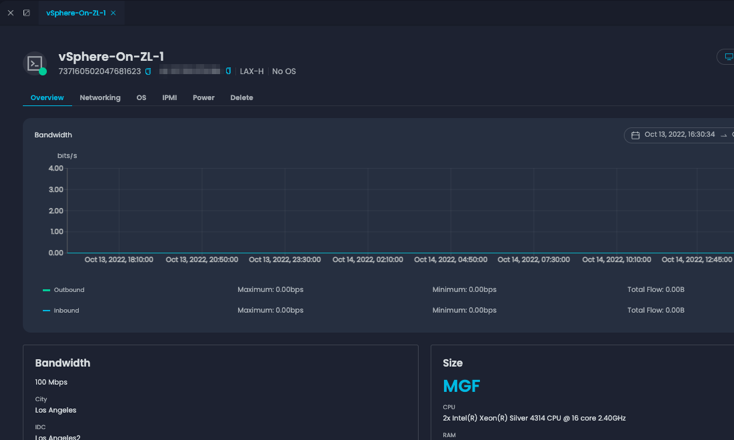
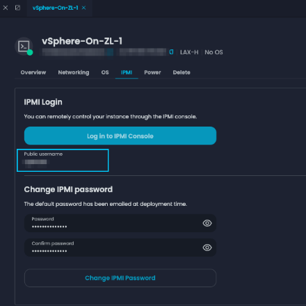
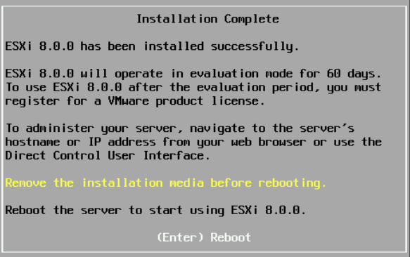
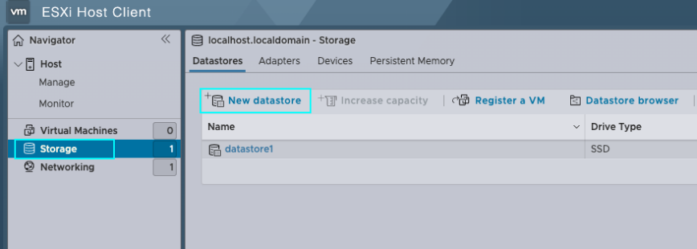
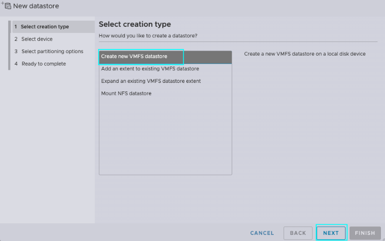
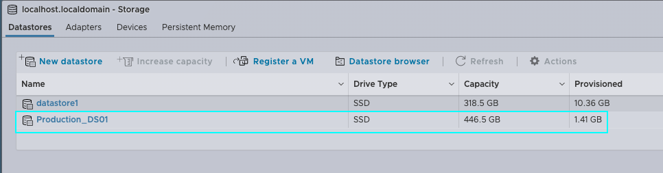

# vSphere Stand-Alone on Zenlayer Bare Metal Cloud

## About the Author

Muhammad Ali Hussain, or **Ali** for short, is a Sr. Solutions Engineer who’s been with Zenlayer for over two years. Ali’s core technical competency is systems engineering, particularly virtualization and cloud computing using VMware, Fortinet, Microsoft, and Dell products. He served in the United States Marine Corps for nine years where he departed as a Cyber Systems Chief, working with enterprise architectures while following strict security and governance around DoD and NIST standards to ensure uptime and availability for mission-critical applications. After USMC, Ali became a Sr. Systems Engineer at an MSP working with government organizations to lead the development and implementation of their virtual desktop and overall infrastructure.

His hobbies include spending time with family and researching virtualization advancements in data center, network, storage, and desktop for which he has a deep passion.

## Introduction

In today’s lesson, we will demonstrate a step-by-step process to deploy a stand-alone vSphere environment on Zenlayer’s Bare Metal Cloud (BMC). We will lock this environment down by limiting external access and configuring a FortiGate as our Firewall. Then, we will configure a VPN on this FortiGate for authenticated access to manage our stand-alone cluster.

The configuration we’ll be using for this lab is shared below. I’ve also provided a few simple logical diagrams to illustrate this topology.

.png>)

Who’s going to benefit from a build like this? Pretty much anyone, from small organizations looking for data center stability, such as power and cooling, to customers who have applications they want to be hosted in the cloud closer to the edge so that they’re widely accessible. It’s also great for applications that are resource intensive that may need self-defined contention ratios. Another possible use case is finance, like developing your applications on current platforms without the need for capital expenditure.

One of the unique benefits of leveraging bare metal is that this environment is entirely dedicated to you.

You can further expand on this build by integrating a storage node and leveraging vSphere’s full suite of services to greatly enhance your uptime and availability. Zenlayer’s Bare Metal Cloud gives power to the you, the user – the power to define your own infrastructure resiliency, built on top of Zenlayer’s underlying architecture, hosted within leading facilities around the globe.

Now let’s go over what’s included in this lab, some of the links we’ll use, the operating system (OS), and hardware configuration.

**Zenlayer’s Portal**\
****Link : [https://console.zenlayer.com](https://console.zenlayer.com/)

**Hardware**\
Chassis: Dell PowerEdge R650\
CPU: Intel Xeon Silver 4314 (16C, 32T/2.40GHz)\
RAM: 128GB RAM\
DISK: 4 x 480GB SSD\
NIC: 2 x 10Gb SFP+

**OS**: VMware vSphere Hypervisor (ESXi) 8.0

**Firewall**: Fortinet FortiGate VM01V

## Host Provisioning

In this chapter, we’ll be going over zenConsole. We will understand its basic functionality and the steps required to provision and deploy a BMC. Here, we’ll go through the many customizations and options available to users when provisioning their host.

First, we’re going to navigate to zenConsole at [https://console.zenlayer.com](https://console.zenlayer.com/). After logging in, you’ll be presented with the console homepage. Here, you can see all the services available to be provisioned, along with any services you’ve already provisioned and their current status.

Click on **\[+ **_****_** Create]**. After your selection is expanded, click on **\[Create Bare Metal Instance]**.

.png>)

After doing so, you’ll be brought to the _**Create Bare Metal**_**  **_**Instance** _ page. Here, you will select the location you want to deploy your BMC. In our case, we’re going to select **\[Americas]**, on the right-hand pane we will further specify **\[Los Angeles]**. If the device configuration of your choosing isn’t available, you can select another zone to see its availability. Here, we’ve selected **\[LAX-H]**.

.png>)

Next, we will select your host configuration. In our example, we’ve selected **\[MFC]**, the configuration shown earlier. Below, you’ll see a few different distributions readily available for installation. In our case, vSphere ESXi 8.0 isn’t available, therefore we’ll demonstrate a manual installation by unselecting **\[Choose Your Operating System]**. At the RAID configuration, we will navigate to the right-hand pane and select **\[Customized RAID Configuration]** in blue. This allows us to create two different disk groups, (1) RAID 1 for the operating system and (1) RAID 1 for the capacity, in our case for the VMFS Datastore. For the purpose of this demo, we will leave **\[Create Partition]** unselected and go with the defaults.

After completing your partition configuration, you can proceed to _**Login Method**._ If you’re going with **\[System-Generated Root Password]**, your password will be emailed to the registered account. If you choose to **\[Set Up Own Password]**, you will be required to specify the password in the field below. Next, we’ll adjust the quantity to (3), further expanding _**Label Your Instance** _ to include (3) rows of specifications. After you’ve labeled your machine, proceed to the next step by clicking on **\[Go to Network Interfaces]**.

Now, my options are limited due to the test profile on this page. For general users, you’ll have the option for _**Flat Rate**, **Data Transfer** _ and _ **95/5 (Burstable Billing)**._ In our case, we’re going to leave it as **\[Flat Rate]**, then increase the _**Configure Bandwidth Cap**_ to \[100Mbps]. Proceed to the next step by clicking on **\[Go to Add-On]**.

On the _**Add-On**_ page, you can specify any additional needs for your BMC. These can include added _**Elastic IPs**, **IP Anycast** (for select locations), Zenlayer’s **DDoS Protection** (ZDP) and more!_ In our example, we’re going to keep the default and click on **\[Continue to Check-Out]**.

.png>)

Finally, we will review our order. After reviewing your order, click on **\[I Agree to Zenlayer Customer Agreement…]** then **\[Confirm Order]** to initiate the host provisioning.

.png>)

After confirming your order, you’ll be redirected to the BMC inventory page. Here, you can see your host state as _Blue,_ indicating that it’s still undergoing the initial process. To the right, under _**Created & Billing Time**,_ you can see that your device is still _**Installing**._

## Network Provisioning

Now that we’ve provisioned our host, we’re going to modify some additional settings. These will enable our environment to communicate with each other. We’re going to provision both the public and private VLANs that we’ll later need to configure our stand-alone host, vCenter for management, and FortiGate for the firewall.

While the host undergoes its initial configuration process, we will configure the WAN interface for these devices. Please note that we’re only adding these hosts to this network during initial provisioning. After we configure our firewall, we will migrate these off the public network and onto their private networks.

Let’s start off by selecting **\[Public Virtual Interface]** (PuVI) __ on the left-hand pane. Then, select the same city and zone in which you’ve provisioned your BMC. In our case, we’ll select **\[Los Angeles]** and the **\[LAX-H]** zone. Next, we’ll choose our preferred CIDR block. For this lab we will select **\[13 IPs or /28]**. Label your PuVI in the dialogue shown below. In our example, we’ve labeled this PuVI as _**vSphere-On-ZL-PuVI**._ Finally, select your _ **Resource Group**_ if applicable, then click on **\[Zenlayer Agreement]** and complete your order by clicking on **\[Create]**.

.png>)

Next, you’ll be redirected to your _Public Virtual Interface_ inventory page. I know that my BMC has completed its provisioning process because I’ve received the _zenConsole BMC Created_ email. Let’s move on by assigning our host the newly created PuVI. From the inventory page, select your newly created PuVI. For our example, we’ll select **\[vSphere-On-ZL-PuVI]**.

After selecting your PuVI, a window will expand on the right-hand pane. Here, you will see each IP address within your PuVI. Select the dropdown labeled **\[Assign to an instance]** and assign the IPs to your recently provisioned hosts. Once selected, you’ll see a spinning wheel on the right displaying _**Assigning**._ Before exiting this window, take note of your network and your VLAN ID by clicking on **\[Overview]** and reviewing the contents of this tab.

.png>)

.png>)

Next, we’re going to move over to configure the LAN interface. Select **\[Virtual Private Cloud]** (VPC)**.** Here, if you don’t have any provisioned VPCs, click on **\[Create Virtual Private Cloud]**.

After making your selection, you’ll be presented with the _**Create Virtual Private Cloud** _ page. Here, we’re going to select the region, city, and zone in which our BMCs are deployed. In our case, we’re going to select **\[North, Central, and South Americas]**, then on the right, select **\[Los Angeles]** and **\[LAX-H]** zone.

We’ll then scroll down to configure our _**IP Range**_. Click on the dropdown to adjust the **\[IP Range]** to your choosing based on the available options. Next, we’re going to label this VPC. In our case, we’ll label it **\[vSphere-On-ZL-VPC]**. Next, we will select the location for this VPC to be hosted, which for our example will be **\[LAX-H]**. In the section below, _**Configure the private IP range of the subnet**,_ we’ll use the dropdown to adjust our subnet. For this lab, we’ll demonstrate this and further subnet our IP range down to /25 by clicking the drop down and selecting **\[/25]**. Finally, label your subnet, which we’ve labeled **\[vSphere-On-ZL-SN0]** for this example. Select your resource group if applicable and click on **\[Create]**.

Returning to the VPC inventory page, you can now see that your VPC is provisioning. Let’s click on **\[+ Add Instance]** to start assigning this to our BMCs.

After clicking on **\[+Add Instance]**, a new window will pop up. Here, select your recently created subnet **\[vSphere-On-ZL-SN0]**. Next, use the dropdown to choose your BMC and check the box next to **\[Customize Private IPv4 Address]**. Finally, specify the private IP assigned to his host in sequential order. Click on **\[Create]** and repeat the steps for the remaining hosts.

.png>)

## OS Installation

Now that we’ve established our network, let’s start installing our operating system (OS). Since our distribution wasn’t available from the options to choose from, we’re going to do this via **Virtual Media** and the **iDRAC console**.

Navigate to your host under BMC inventory and select the host you’ll be installing the OS on. For our example, we’re going to select **\[vSphere-On-ZL1]**.

.png>)

Now, another window will expand on the right-hand pane. Here, you can see various options such as _**Overview**, **Networking**, **OS**, **IPMI**, and **Delete**._ We won’t be covering these in this lesson, but these options let you monitor host usage, edit configuration, access the IPMI interface, set power management, and delete the BMC.

Select **\[IPMI]**, to proceed to the OS installation. After selecting, note the username under the blue _**log in to IPMI Console**_ (this can be case-sensitive). Now let’s click on **\[Log in to IPMI Console]** to access the iDRAC console of this host.

zenConsole’s provisioning tool will simplify the process by automating the initial provisioning steps. This can be reviewed under the iDRAC 9 by selecting **\[Storage]**, then **\[Virtual Disk]**. As you can see, our (2) RAID 1 groups are now ready to go.

.png>)

Let’s return to the main page by clicking on **\[Dashboard]**. Navigate to the bottom right of the page and select **\[Virtual Console]**. You’ll get a _pop-up_ with the virtual console, so make sure that your pop-up blocker isn’t blocking it.

This step can vary between different manufacturers. Zenlayer provides hosts from Dell, SuperMicro, Inspur, and HP. For this lesson, we’ll follow the iDRAC method. At the top right of your window, select **\[Virtual Media]**. Another window will appear, in which we’ll select **\[Connect Virtual Disk]**. Next, select **\[Choose File]** under _**Map CD/DVD**._

After selecting your media from the file browser, select **\[Map Device]** to the right of _**Map CD/DVD**._ Now your ISO will be connected to host. Exit the window by clicking on **\[Close]**. Next, restart the host by issuing a **\[CTRL+ALT+DEL]**. After reboot, the device will boot up with the _**ESXi Installer**._

.png>)

After the initial startup and loading process, you’ll be presented with the message _**Welcome to VMware ESXi 8.0.0 Installation**._ Here, select **\[Enter]** to continue with the installation. Accept the _**End User License Agreement (EULA)** _ by selecting **\[F11 Accept and Continue]**. __ Now the installer will run a scan to verify hardware components.

.png>)

After selecting your **\[Disk Group]** by navigating with the **Up/Down **_****_** arrows**, press **\[Enter]** to continue to the next step.

.png>)

At the next prompt, select your default keyboard layout. In our case, we will select **\[US Default]**. Press **\[Enter]** to proceed to the next step.

.png>)

Enter your root password, then press **\[Tab]** and confirm your password. Press **\[Enter]** to continue to the next step.

Select **\[F11]** at the next step to confirm your installation and initiate the process. Stand by as the installation completes. You’ll be given a prompt displaying the progress in a percentage.

Now press **\[Enter]** to reboot your newly provisioned ESXi Host!

Repeat these steps for the remaining hosts to install ESXi. Once completed, proceed to the next section.

## DCUI Configuration

Next, we’ll cover the initial configuration steps as done through the **Direct Console User Interface** (DCUI). Here, we’ll input our ESXi’s IP configuration, then test remote access via the **Web Client**. After this is done, we’ll lock down our host from external access by configuring the local firewall.

After reboot, you’ll be presented with the **DCUI**. Here, press **\[F2]** to be prompted with the login credential page. Enter the username \[root] and the password previously defined in the install.

.png>)

After logging in, navigate to _**Configure Management Network** _ and press **\[enter]**. On this page, select **\[Network Adapters]**. Here you’ll see the network interface cards (NICs) that are actively connected to an interface. The first port will be your WAN interface, the second your LAN interface. Here, make sure the **\[X]** is toggled for the first connected interface. After making this change, press **\[enter]** to be redirected to the previous screen. _Note, in some cases, these interfaces can be flipped, in which case you should change the active interface to the secondary and try again._

Now navigate to _**IPv4 Configuration** _ and press **\[enter]**. Here, assign the PuVI IP assigned to the host. _Remember, to see the **Gateway**, **Subnet Mask,** and **IP**, you can navigate to the **Networking** tab of the host from **zenConsole** under the section labeled **Public Virtual Interface**._ After assigning, press **\[enter]** to save your configuration. Press **\[esc]** to go to the previous page then **\[Y]** to apply your settings and restart the network adapter.

.png>)

Open a browser and enter **https://\<ESXi IP>/ui** to navigate to the web client. After doing so, you’ll be greeted with the page shown below. Log in by entering the credentials previously configured in the DCUI.

.png>)

Now let’s secure this host by limiting external access. After logging in, navigate to the network settings by selecting **\[Networking]** on the left-hand pane. Then, on the right-hand pane select **\[Firewall rules]**. You’ll be presented with the local firewall rules for this ESXi. Scroll down to the enabled services and apply your whitelist as needed. We will do this temporarily before we configure our firewall.

.png>)

Select a **\[service]** at the prompt, then select the second radio button _**Only Allow Connections from the Following Networks**._ Here, enter your source IP and your PuVI Networks. __ Click on **\[OK]** to close the prompt and return to the firewall page on the web client.

.png>)

_Remember, ESX hosts and vCenters should be properly secured and inaccessible over the public internet for best security practices. In a production environment, it’s always best to place a firewall on the front end._

Repeat these steps to configure the remaining hosts within your cluster. After completion, proceed to the next section where we will configure our capacity datastore deployed during the initial provisioning.

## Datastore Configuration

From your web client’s homepage, navigate to the left-hand pane and select **\[Storage]**. On the right, select **\[New Datastore]**. After you’ve made your selection, a new window will pop-up.

In our example, we will create another VMFS datastore to separate our host files and our VM files. On the new datastore window, select **\[Create New VMFS Datastore]**, then click on **\[Next]**.

At the next prompt, you’ll be asked to select your disk and provide a label for this VMFS datastore. Here, we’ll label this as **\[Production\_DS01]** and select the virtual disk previously provisioned in iDRAC. Press **\[Next]** to proceed to the next step.

.png>)

Now it’s time to select your partitioning option. For this example, we’ll use the full disk capacity and leave it as default. Press **\[Next]** to proceed. After reviewing your configuration, at the next prompt select **\[Finish]** to provision your datastore.

.png>)

After the configuration is complete, you’ll be able to view the newly created datastore within your storage pane.

After fully configuring your datastore, let’s create a directory for ISOs locally on this server. This is not required but will _significantly_ reduce your deployment time.

From the storage view, select **datastore1** (default datastore). After, select **\[Datastore Browser]** on the datastore page.

.png>)

In your datastore browser, select **\[Create Directory]**. Create a directory labeled **\[ISOs]**. Next, we’re going to upload our ISOs locally on this datastore. Select **\[Upload]** and use your native explorer to transfer your ISO to your datastore. In our example, you can see our directory labeled **\[ISO]** and our ISOs uploaded into this directory.

.png>)

Now that we’ve staged our ISOs, let’s configure our private network using vSphere Standard vSwitches.

## Network Configuration

By default, when deploying ESXi, two PortGroups will be created. This includes your _**VM Network** and **Management Network**._ The Management Network will be used by the host to manage host networking with the default TCP/IP stack hosted on vSwitch0. _You should be cautious with changes on the Management Network as it may affect your host connectivity. In the event of a misconfiguration, you can restore the network configuration via DCUI._ The VM Network is used for Virtual Machine networking. In both cases, they are connected to our WAN interface via vSwitch0. We’re going to separate our Private and Production networks by assigning dedicated uplinks to individual vSwitches.

Let’s navigate to the left-hand pane and select **\[Networking]**. On the right, select **\[Virtual Switches]**, then **\[Add Standard Virtual Switch]** to open the vSwitch configuration window.

In the vSwitch Configuration window, enter a name for this vSwitch, which we’ve named _vSwitch1_ in our example. Next, use the dropdown for **\[Uplink1]** and select your unused online **Physical Interface**. _For this lesson, this is the only change we’ll make at this step. Stay tuned for future discussions about optimization with your vSwitches to support different workloads._ After finalizing your changes, click on **\[ADD]** to complete this section.

.png>)

Now, let’s configure our Port Group. Under the same left-hand pane _**Networking**_ tab, select **\[Port Groups]**, then **\[Add Port Group]**.

.png>)

After selecting **\[Add Port Group]**, a configuration window will pop up for the Port Group. Here, specify a name for your Port Group, which we will call **LAN** in this example. Select **0** for no VLAN assignment - this is required for BMC due to network assignment on our backend. For MHS, you can further specify a VLAN tag. Next, select **\[vSwitch1]**, the vSwitch created in the previous section. When this is done, click on **\[ADD]** to apply your configuration.

.png>)

Before we move over, we’re going to rename _**VM Network** _ to _ **WAN**_. This is the Port Group assigned to vSwitch0. Additionally, we’ll create __ **\[LAN2]** assigned to vSwitch0 and **\[WAN2]** assigned to vSwitch1. See below for a quick example. We’ll explain why we did this in the upcoming steps.

.png>)

Next, let’s look at our firewall. Firewalls tend to have a unique configuration between vendors, but generally have the same underlying requirements. In most cases, you have (1) interface for WAN and another for LAN. Based on policies and rules, you can bridge access to these networks for your VPN users, or even set up NAT policy to translate your private network to the public. Below, I’ve shared an image of how my setup looks. _Please note that the PortGroup assignments are based on the image above._

.png>)

Below, I’ve included a picture of how this looks on the ESXi host’s VM configuration. As you can see, each _**Network Adapter** _ has its own dedicated Port Group.

.png>)

After you’ve validated connectivity (Externally via VPN), we’re going to migrate our hosts off our WAN and onto our LAN networks. This can get slightly tricky, so we need to make sure we do this in the order defined.

1.  First, migrate the ESXi servers _**not hosting your firewall**_. Navigate to the DCUI via IPMI through zenConsole, change the **vmnic** used by the Management Network. In our case, this is **\[vmnic4]**.\

    .png>)
2. Leave the VLAN configuration as is, **\[Not Set]**.
3.  Change the IPv4 configuration to your LAN IP assigned earlier during _PrVI configuration,_ in our case this is **\[10.0.0.4/24]**. We’ve assigned the _LAN Gateway_ \[10.0.0.10] to our host. Select **\[Enter]** to confirm the change.\

    .png>)
4. Select **\[ESC]** to exit the network configuration. Be sure to select **\[Y]** to apply your con
5.  Now, let’s test connectivity by selecting **\[Test Management Network]**. Below, you can see from our test that our host is able to access the gateway.\

    .png>)
6.  While connected to the VPN, navigate to the web console for your host. Select **\[Networking]** and return to **\[Virtual Switches]**. Review the assigned uplink for _**vSwitch0**_ by highlighting and selectin **\[Edit Settings]**. You can see that vSwitch0 has vmnic4 assigned as the designated _**Physical NIC**_.\

    .png>)
7.  Let’s navigate to vSwitch1 and select **\[Edit Settings]**. You’ll see that because we’ve migrated vSwitch0 to vmnic4, now vSwitch1 has no uplink selected. Use the **\[Uplink1]** dropdown and select **\[vmnic5]** your WAN interface.\

    .png>)
8. Repeat these steps for the remaining servers _**not hosting your firewall.**_** ** After you’re done, proceed to the next step.
9. Now, let’s migrate the server _**hosting our**_ _**Firewall**_. Please return to _**Physical Interfaces** _ and note the **vmnic\[#]** for your WAN interface. In our case, this is **\[vmnic5]**.
10. Before making any changes on the host, migrate the firewall _**Port Groups** _ from WAN to WAN2 and LAN to LAN2. See example below. _Please note that you will lose connectivity to your VPN momentarily after applying this change._\
    __

    .png>)
11. Now navigate to the **DCUI**, as we did previously. Proceed with steps **\[1-4]** as we did with our other hosts.
12. After you’re done, navigate to and select **\[Troubleshooting Options]** from DCUI.\

    .png>)
13. Next, select **\[Enable ESXi Shell]**. To access the shell from the DCUI, enter **\[ALT+F1]**.\

    .png>)
14. At the shell, enter the below **cmdlets** without the _**brackets**_.

    a. \[esxcli network vswitch standard list]

    * This will show you the vSwitches on this ESXi server.

    b. \[esxcli network vswitch standard uplink add –uplink-name**=\<enter vmnic#>** --vswitch-name=vSwitch1]

    * \<enter vmnic#> = This will be the WAN vmnic previously identified.
    *   \<vSwitch#> = This will be the vSwitch associated with our WAN interface.\

        .png>)

    c. Exit by entering **\[ALT+F1]** and be sure to repeat steps **\[12-13]** above. This time, disable the ESXi Shell.
15. Verify connectivity by logging into your VPN and accessing your ESXi servers, which are now hosted on the _**Private Virtual Interface (PrVI)**._

After this change has been applied, our ESXi networking will be configured. I’ve created a sample image showing the change we’ve applied. Afterwards, the Port Groups listed in \[RED] can be removed.

.png>)

Now that we’ve placed our ESXi hosts behind our firewall and off the public network, please proceed to the final section where we will cover how to deploy our **vCenter Server Appliance** (vCSA).

## vCSA (vCenter) Deployment

In this section, we’ll cover how to deploy vCSA. We will go through the installation steps and connect our hosts to the vCSA. vCenter is a powerful tool included with the vSphere package that allows you to centrally manage your vSphere cluster. To experience the complete vSphere feature set, vCenter is required within your cluster for services such as **DRS**, **HA**, **vMotion**, **vSAN**, and much more. Additionally, it can provide a holistic solution for managing your infrastructure by providing orchestration and even lifecycle management. Now, let’s proceed with this installation.

### **Requirements for vCenter**

Prior to deploying your vCenter, there are a few requirements that need to be addressed. Below, I’ve shared the VMware publication which highlights all the requirements prior to deploying vCenter. After completing these, proceed to the next step to begin your vCenter deployment.

Link: [Deploying the vCenter Server Appliance (vmware.com)](https://docs.vmware.com/en/VMware-vSphere/7.0/com.vmware.vcenter.install.doc/GUID-F06BA415-66D8-42CD-9151-701BBBCE8D65.html)

Navigate to the vCenter ISO and select **\[vcsa-ui-installer]**. Next, select the parent distro you’re deploying this ISO from. In our case, this is **Windows**, so we’ll select **\[win32]**. Next, select **\[installer]** to launch the vCSA installation wizard.

.png>)

At the first prompt of the wizard, select **\[Install]**.

Read through the prompt in the _**Introduction**_, then click on **\[Next]**.

Read the **End User License Agreement (EULA)**, then proceed by selecting the radio button next to _**I accept the terms of the license agreement**._

At the next prompt, specify the **\[IP]** of the ESXi hosting the vCenter. Enter the **\[HTTPs Port Number]** if it’s different from the default. Finally, enter the credentials for your ESXi host. _Be sure your host is network-accessible from the device from which you’re deploying vCenter_. Click on **\[NEXT]**.

.png>)

To connect to the ESXi host, you’ll be prompted with a _**Certificate Warning**._ After verifying the SHA1 thumbprint of your ESXi host, select **\[YES]** to proceed to the next step.

At the next prompt, enter the vCSA VM name under **\[VM Name]**. Next, provide a root password and confirm the password below.

.png>)

Now provide a _**Deployment Size**_ by using the dropdown to select the correct size based on the conveniently placed sizing chart below. In our example, we’ve selected **\[Small]**. Select the **\[Storage Size]** based on your infrastructure size and the requirements to host your stats, alarms, events, etc. After completing this, we’ve selected **\[Default]**. Click on **\[NEXT]** to proceed to the next step.

.png>)

Select the datastore the vCSA files will be stored in during the provisioning of the vCenter. For our example, we’ve selected **\[Production\_DS01]**. We will _**Enable Thin Disk Mode**_ due to the available capacity. If you’re deploying a vSAN cluster, it’s advised to select **\[install on a new vSAN cluster containing the target host]** as this will further simplify the vSAN deployment steps required later. _Please note that we will not be configuring vSAN in our demo, so we will leave this unselected._

.png>)

Enter the required fields for the network settings of your vCenter, then click on **\[Next]**.

**Network** \[PortGroup Assigned to VM]

**IP Version** \[IPv4 or IPv6]

**IP Assignment** \[Static or DHCP]

**FQDN (Fully Qualified Domain Name)** \[FQDN of vCenter OR IP Address]

**IP Address** \[IP Address of vCenter]

**Subnet Mask or Prefix Length** \[SNM (255.255.255.x) OR Prefix (/24, /25 etc)]

**Default Gateway** \[Gateway IP Address]

**DNS Server** \[Domain Naming Server IP of hosted A record, comma-separated for multiples]

**Common Ports** \[Port 80 (HTTP) / Port 443 (HTTPs) or customize]

After reviewing your configuration, click on **\[Finish]** at the next prompt to initiate the installation.

A sliding bar will appear that shows your vCenter deployment progress. _You can also find this under **\[Recent Tasks]** from your ESXi host._

.png>)

.png>)

After installation, you’ll be prompted to proceed to the next step by clicking on **\[Continue]**. _You can alternatively return to this step by navigating to the vCSA address with port 5480 (ex._ [_https://10.0.0.15:5480_](https://10.0.0.15:5480/)_)_

.png>)

### **Introduction**

At the next prompt, select \[Next] to initiate the Stage 2 installation.

### **vCenter Server Configuration**

At the next prompt, select **\[Time Synchronization]** and enter your NTP address or synchronize time with your ESXi Host. Select **\[SSH Access]** to enable SSH if configuring vCenter Server High Availability. In our example, we’re going to leave this **deactivated** because we don’t have our ESXi connected to shared storage.

.png>)

### **SSO Configuration**

_**If creating a new SSO domain**_ (first vCenter on network), select **\[Create a new SSO domain]**.

Enter the SSO domain name for your network **\[zenlayer.lab]**

Single Sign-On username - this will be static, and by default assigned to **\[administrator]**

Enter and confirm the **\[administrator]**

_**If joining an existing**  **SSO domain**_, select **\[Join an existing SSO domain]**.

vCenter Server - **\[vCenter Server IP or FQDN on your SSO Domain]**

HTTPs Port - **\[Port to Access vCenter]**

Single Sign-On username - this will be static, and by default assigned to **\[administrator]**

Single Sign-On password - **\[administrator password to SSO domain]**

After you’re done, click on **\[NEXT]** to proceed to the next section.

Read the **CEIP Description.** By joining, you’ll give access for VMware to collect data from your vCenter. This is important as it allows VMware to use the collected data to further improve their product. After selecting **\[Join the VMware’s Customer Experience Improvement Program (CEIP)]**, select **\[Next]** to review the final section.

### **Ready to Complete**

Review the configurations and select **\[Finish]** to finalize your vCenter deployment.

vCSA Installer will now proceed to the finalization of Stage 2.

.png>)

After successful installation, you’ll be prompted with the vCSA credentials. After verifying the information, select **\[CLOSE]** to complete the install. Access your vCenter by navigating via your web browser to validate.

.png>)

Let’s open a browser and navigate to our vCenter.

### _**Here are a few tips:**_

_If you’re using an internal DNS and accessing via VPN, make sure you modify the policy to assign the internal DNS for your client. This allows your client to navigate to vCenter using the DNS hosting the A record. vCenter by default will install a self-signed certificate, which may prompt your browser to display an “untrusted site” page. In this case, assign an organization certificate, or trust the self-signed certificate for your vCenter. Below, I’ve shared a Publication by VMware that explains this thoroughly._

Link: [How to download and install vCenter Server root certificates to avoid Web Browser certificate warnings (2108294) (vmware.com)](https://kb.vmware.com/s/article/2108294)

Log in using the credentials configured during your vCSA deployment. The default user account will be **\[administrator@domain.com]**

.png>)

After logging in, you’ll be presented with the vCenter hosts and clusters page. Expand your vCenter on the left-hand pane and select **\[New Datacenter]**.

.png>)

At the prompt, enter the Datacenter name you’d like assigned. We’re to calling ours **\[ZL-BMC-NA]** for Zenlayer – BMC – North America.

.png>)

Next, right-click on our data center and select **\[New Cluster]**.

.png>)

Like before, enter a name for your cluster at the prompt. In our case, we’ve named it **\[ZL-BMC-LAX]** for Zenlayer BMC Los Angeles. Since we’re configuring stand-alone hosts for this demo and don’t have storage configured, we’re going to leave the defaults and move on by clicking on **\[Next]**.

.png>)

Since we’re composing a new cluster image using vSphere 8, we’re going to review the next page and click on **\[Next]** to proceed to the last page.

.png>)

After reviewing the cluster configuration, click on **\[Finish]** to finalize your cluster setup.

.png>)

Now that we have our cluster configured, let’s add our hosts to this vCenter. Navigate to your cluster, right-click and select **\[Add Hosts]**.

.png>)

At the prompt from the **\[New Hosts]** tab, add each host you want to this vCenter. You can also click on the radio button next to **\[Use the same credentials for all hosts]** to further simplify the process, then click on **\[Next]** to proceed. Now you may be prompted to verify and accept your ESXi host’s certificate. Select the radio button next to each host and proceed by clicking on **\[OK]**.

.png>)

Next, you’ll be given a host summary. This is important to review, especially if you’re configuring HA (High-Availability) and DRS (Distributed Resource Scheduler). Since we’re configuring stand-alone hosts, we can proceed to the next step and ignore the warnings about our _**Powered on VMs**._ Click on **\[Next]** to proceed.

.png>)

Next, you’ll be prompted to select a host to copy the _**Cluster Image**_ from, or to not select one at all. Here, if you don’t already have one and the configuration on your ESXi image is up to date with your organization’s requirements, you can choose to copy the image of this host and retain it on the cluster. This lets **vSphere Lifecycle Manager** (vLCM) to update and upgrade software and firmware on your hosts and allows you to keep your cluster nodes uniform. After completing this step, click on **\[Next]** to proceed to the review section.

.png>)

Review your cluster configuration. If everything looks good, click on **\[Finish]** to create your cluster and add your hosts.

.png>)

**Congratulations**, you’ve now deployed vCenter to monitor your ESXi hosts!

Stay tuned as we provide further integration between VMware and Zenlayer. We’ll be showing additional use cases surrounding some of VMware’s data center virtualization products by integrating a storage node to enable the full suite of VMware’s vSphere. Plus, we’ll be demonstrating services such as HA, DRS, vMotion, and products like vSAN, vRealize Orchestration, NSX and **many more**!

.png>)

## Final Thoughts

Thank you for following this guide. I hope you enjoyed reading this as much as I enjoyed making it.

As always, if you have any questions, feel free to reach out to Zenlayer’s Global Solutions Engineering team at **GSE@Zenlayer.com**. We’re here to help facilitate any solution, no matter the complexity, as part of our mission to power a better-connected world. Cheers!&#x20;

