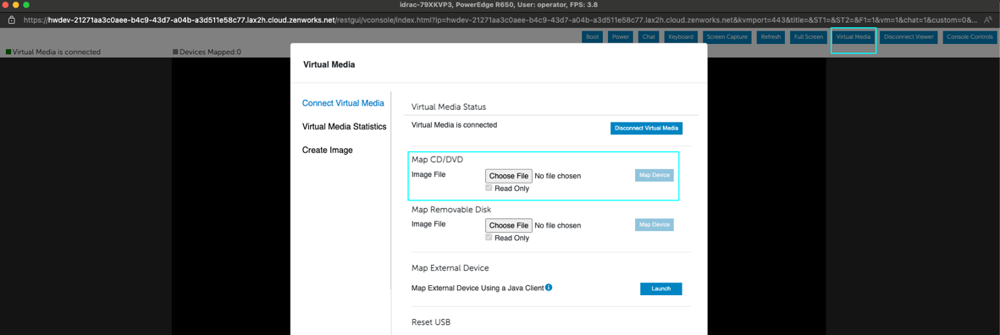
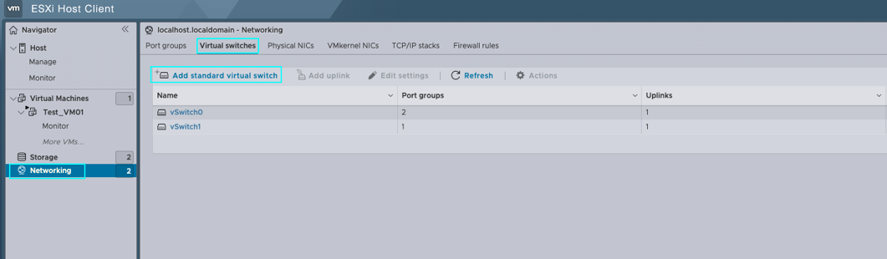
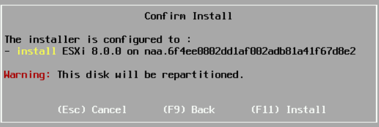

# vSphere Stand-Alone on Zenlayer Bare Metal Cloud

We will lock this environment down by limiting external access and configuring a FortiGate as our Firewall. Then, we will configure a VPN on this FortiGate for authenticated access to manage our stand-alone cluster.

The configuration we’ll be using for this lab is shared below. I’ve also provided a few simple logical diagrams to illustrate this topology.&#x20;

<figure><figcaption>
Topology
</figcaption></figure>

Who’s going to benefit from a build like this? Pretty much anyone, from small organizations looking for data center stability, such as power and cooling, to customers who have applications they want to be hosted in the cloud closer to the edge so that they’re widely accessible. It’s also great for applications that are resource intensive that may need self-defined contention ratios. Another possible use case is finance, like developing your applications on current platforms without the need for capital expenditure.

One of the unique benefits of leveraging bare metal is that this environment is entirely dedicated to you.

You can further expand on this build by integrating a storage node and leveraging vSphere’s full suite of services to greatly enhance your uptime and availability. Zenlayer’s Bare Metal Cloud gives power to the you, the user – the power to define your own infrastructure resiliency, built on top of Zenlayer’s underlying architecture, hosted within leading facilities around the globe.

&#x20;

Now let’s go over what’s included in this lab, some of the links we’ll use, the operating system (OS), and hardware configuration.

**Zenlayer’s Portal:** [https://console.zenlayer.com](https://console.zenlayer.com)

**Hardware**

* Chassis: Dell PowerEdge R650
* CPU: Intel Xeon Silver 4314 (16C, 32T/2.40GHz)
* RAM: 128GB RAM
* DISK: 4 x 480GB SSD
* NIC: 2 x 10Gb SFP+
* OS: VMware vSphere Hypervisor (ESXi) 8.0
* Firewall: Fortinet FortiGate VM01V

## Host Provisioning

In this chapter, we’ll be going over zenConsole. We will understand its basic functionality and the steps required to provision and deploy a BMC. Here, we’ll go through the many customizations and options available to users when provisioning their host.

First, we’re going to navigate to [zenConsole](https://console.zenlayer.com). After logging in, you’ll be presented with the console homepage. Here, you can see all the services available to be provisioned, along with any services you’ve already provisioned and their current status.

Click on **+ **_****_** Create**. After your selection is expanded, click on **Create Bare Metal Instance**.

<figure><figcaption></figcaption></figure>

After doing so, you’ll be brought to the **Create Bare Metal Instance** __ page. Here, you will select the location you want to deploy your BMC. In our case, we’re going to select **Americas**, on the right-hand pane we will further specify **Los Angeles**. If the device configuration of your choosing isn’t available, you can select another zone to see its availability. Here, we’ve selected **LAX-H**.

<figure><figcaption></figcaption></figure>

Next, we will select your host configuration. In our example, we’ve selected **MFC**, the configuration shown earlier. Below, you’ll see a few different distributions readily available for installation. In our case, vSphere ESXi 8.0 isn’t available, therefore we’ll demonstrate a manual installation by unselecting **Choose Your Operating System**. At the RAID configuration, we will navigate to the right-hand pane and select **Customized RAID Configuration** in blue. This allows us to create two different disk groups, (1) RAID 1 for the operating system and (1) RAID 1 for the capacity, in our case for the VMFS Datastore. For the purpose of this demo, we will leave **Create Partition** unselected and go with the defaults.

<figure><figcaption></figcaption></figure>

After completing your partition configuration, you can proceed to _**Login Method**._ If you’re going with **\[System-Generated Root Password]**, your password will be emailed to the registered account. If you choose to **\[Set Up Own Password]**, you will be required to specify the password in the field below. Next, we’ll adjust the quantity to (3), further expanding _**Label Your Instance** _ to include (3) rows of specifications. After you’ve labeled your machine, proceed to the next step by clicking on **\[Go to Network Interfaces]**.

<figure><figcaption></figcaption></figure>

Now, my options are limited due to the test profile on this page. For general users, you’ll have the option for _**Flat Rate**, **Data Transfer** _ and _ **95/5 (Burstable Billing)**._ In our case, we’re going to leave it as **\[Flat Rate]**, then increase the _**Configure Bandwidth Cap**_ to \[100Mbps]. Proceed to the next step by clicking on **\[Go to Add-On]**.

<figure><figcaption></figcaption></figure>

On the _**Add-On**_ page, you can specify any additional needs for your BMC. These can include added _**Elastic IPs**, **IP Anycast** (for select locations), Zenlayer’s **DDoS Protection** (ZDP) and more!_ In our example, we’re going to keep the default and click on **\[Continue to Check-Out]**.

<figure><figcaption></figcaption></figure>

Finally, we will review our order. After reviewing your order, click on **\[I Agree to Zenlayer Customer Agreement…]** then **\[Confirm Order]** to initiate the host provisioning.

<figure><figcaption></figcaption></figure>

After confirming your order, you’ll be redirected to the BMC inventory page. Here, you can see your host state as _Blue,_ indicating that it’s still undergoing the initial process. To the right, under _**Created & Billing Time**,_ you can see that your device is still _**Installing**._

__

__
