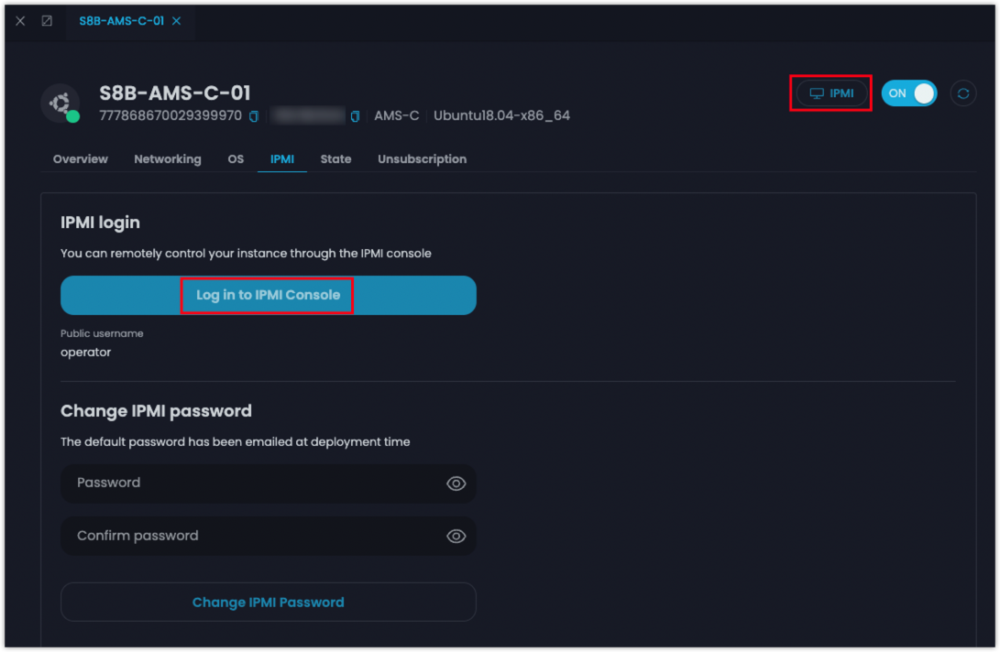
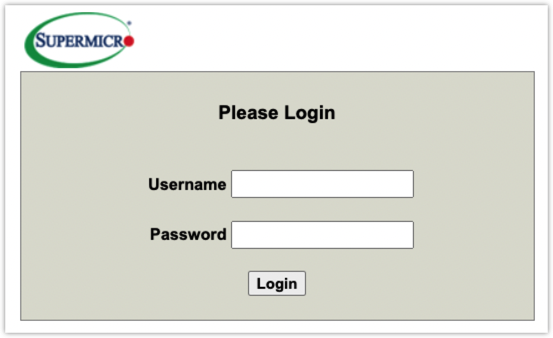
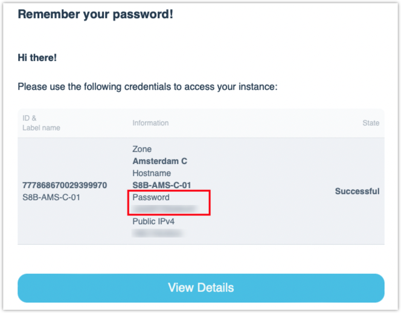
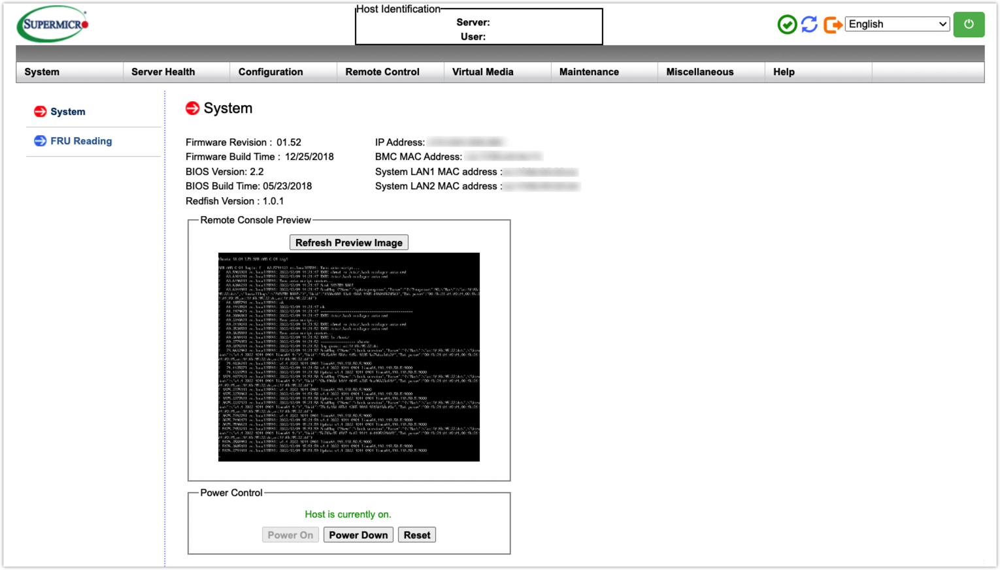

# IPMI

IPMI (Intelligent Platform Management Interface) is a set of standardized specifications for hardware-based platform management systems making it possible to control and monitor servers. You can log in remotely to manage and control your server regardless of the installed system, because IPMI is an industry standard, developed by Intel in cooperation with Dell, Hewlett Packard, and NEC. In short, IPMI is a security guard for your server.

## Key Features

* A universal standard supported by the vast majority of hardware vendors.
* Monitor the physical state of the equipment. For example, using IPMI, you can easily check CPU speeds, fan speeds, voltages, temperatures, event log, and rebooting of the server.
* Set up notifications about how the server is running.
* Simple to change configurations.

## **How to Access IPMI**

You can connect to the IPMI manager via the internet, and the manager utilizes IPMI over IP to connect with the bare metal instance on the server motherboard.

Step 1 - [Create a bare metal instance](../get-started/create-a-bare-metal-instance.md).

Step 2 - Click the label name of the instance to view the details.

Step 3 - Click **IPMI** or **Log in to IPMI Console**.

<figure><figcaption>
IPMI Login
</figcaption></figure>

Step 4 - Enter the username and password.

<figure><figcaption>
Login Interface
</figcaption></figure>

Take Supermicro as an example.

* Username: **operator**
*   Password: the password will be sent to your email box after the instance is created

    <figure><figcaption>
Email Notification
</figcaption></figure>

### Result

<figure><figcaption>
IPMI Console
</figcaption></figure>

After logging in to the IPMI console, you can check your server health and remotely manage your bare metal instance.


<mark style="color:blue;">**Note**</mark>

* <mark style="color:blue;">Instances with different specifications may have different IPMI suppliers. Supermicro, Dell, H3C and Inspur are supported. The actual interface shall prevail.</mark>
* <mark style="color:blue;">For more details about how to use IPMI console, see the user guides of the corresponding IPMI supplier.</mark>


