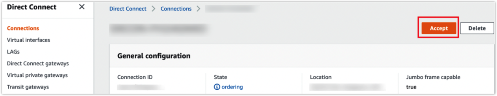

# Create a Multi-cloud Connection in Cloud Networking

Zenlayer's global backbone provides multiple public cloud connections to manage your data across cloud service providers like Amazon Web Services (AWS) and Tencent Cloud. A multi-cloud connection is great for synchronizing or migrating large amounts of data between various clouds.

<figure><figcaption>
Multi-cloud Connection
</figcaption></figure>

## Background Information 

* For this demo, we will be using Zenlayer Cloud Router, a layer 3 networking product. If you need a layer 2 connection, you can still reference this guide as the deployment process is very similar. Choose the best connection type based on your actual network topology.
* See [**Layer 3 connection**](../get-started/create-a-layer-3-connection/) for the basic steps for deployment. The specific configurations are as follows.

## Procedures 

First, create a Cloud Router on [zenConsole](https://console.zenlayer.com/), then validate your connection on the console of your public cloud platform.

### Adding an AWS Access Point 

Assuming that you have AWS services active in Hong Kong:

1. Select the access point in Hong Kong, label the connections as aws-hk and enter your AWS account ID.
2. Configure the BGP routing.
   * Your intranet address: `10.0.0.1/24`
   * Zenlayer intranet address: `10.0.0.2/24`
   * Your ASN: AWS' ASN, **64512** by default
   * Zenlayer ASN: **62610**
   * BGP MD5: You can customize it or copy AWS’ system-generated key. Just be sure to synchronize with the BGP authentication key on AWS.
3. Configure the bandwidth. AWS direct connect provides bandwidth caps like 50 Mbps, 100 Mbps, 200 Mbps, 300 Mbps, 400 Mbps, 500 Mbps, 1 Gbps, 2 Gbps, 5 Gbps, and 10 Gbps. You will be charged for the nearest cap higher than your configuration as the cloud connect bandwidth. Your actual access bandwidth of the access point is still what you have configured.

The final configurations are as follows:

<figure><figcaption>
Configurations of AWS Access Point
</figcaption></figure>

### Adding a Tencent Cloud Access Point 

Assuming that you have Tencent Cloud services active in Frankfurt:

1. Select the access point in Frankfurt, label the connections as tencent-fra and enter your Tencent Cloud account ID.
2. Configure the BGP routing.
   * Your intranet address: `10.0.2.1/24`
   * Zenlayer intranet address: `10.0.2.2/24`
   * Your ASN: Tencent's ASN, **45090** by default
   * Zenlayer ASN: **62610**
   * BGP MD5: You can customize it or synchronize it with the BGP authentication key on Tencent Cloud.
3. Configure the bandwidth. Tencent direct connect provides bandwidth specifications like 50 Mbps, 100 Mbps, 200 Mbps, 300 Mbps, 400 Mbps, 500 Mbps, 1 Gbps, 2 Gbps, 5 Gbps, 8 Gbps, 10 Gbps, 40 Gbps, and 100 Gbps. You will be charged for the nearest cap higher than your configuration as the cloud connect bandwidth. Your actual access bandwidth of the access point is still what you have configured.

The final configurations are as follows:

<figure><figcaption>
Configurations of Tencent Cloud Access Point
</figcaption></figure>


<mark style="color:blue;">**Note**</mark>

<mark style="color:blue;">Pay attention to the</mark> <mark style="color:blue;"></mark><mark style="color:blue;">**Connection provider ID**</mark> <mark style="color:blue;"></mark><mark style="color:blue;">and</mark> <mark style="color:blue;"></mark><mark style="color:blue;">**Shared tunnel ID**</mark><mark style="color:blue;">, which will be used in configurations on Tencent Cloud.</mark>


### AWS Configurations 

1.  Go to [**AWS console**](https://console.aws.amazon.com/console/home?nc2=h\_ct\&src=header-signin) > [**Direct Connect**](https://us-east-1.console.aws.amazon.com/directconnect/v2/home?region=us-east-1#/connections). Click on **Virtual private gateways** to create a new virtual private gateway and give it a name (**test-VGW** in this example). Select the default AWS ASN - **64512**.\

    <figure><figcaption>
Virtual Private Gateway Creation
</figcaption></figure>
2.  Click **Direct Connect gateways** to create a new one, then give it a name (**test-DC-VGW** in this example). Enter the default AWS ASN - **64512**.\

    <figure><figcaption>
Direct Connect Gateway Creation
</figcaption></figure>
3.  Click on the Virtual private gateway - **test-VGW** you created, then go to **Your VPCs** and create a VPC named **test-VPC**.\

    <figure><figcaption>
VPC Creation
</figcaption></figure>
4.  Attach **test-VGW** to the VPC - **test-VPC**.\

    <figure><figcaption>
VPC Attachment 
</figcaption></figure>
5.  Associate Direct Connect gateway - **test-DC-VGW**.\

    <figure><figcaption></figcaption></figure>

    <figure><figcaption>
Direct Connect Gateway Association
</figcaption></figure>
6.  Go to **Connections** and click on the **aws-hk** connection, confirm the information, then click on **Accept**.\

    <figure><figcaption>
Accept Connection
</figcaption></figure>
7.  Create a virtual interface and name it **test-hk**.\

    <figure><figcaption></figcaption></figure>

    <figure><figcaption>
Virtual Interface Creation
</figcaption></figure>

    * VLAN: The **VLAN ID** on zenConsole. Here, it is **5**.
    *   BGP ASN: The ASN of Zenlayer - **62610**

        <figure><figcaption></figcaption></figure>
8.  Click on **test-hk,** then **Add peering**.\

    <figure><figcaption></figcaption></figure>

    <figure><figcaption>
Add BGP Peering
</figcaption></figure>

    * BGP ASN: The ASN of Zenlayer - **62610**
    * Amazon router peer IP: **Your intranet address** - `10.0.0.1/24` on zenConsole
    * Your router peer IP: **Zenlayer intranet address** - `10.0.0.2/24` on zenConsole
    *   BGP authentication key: **BGP MD5 of customer** - **123** on zenConsole&#x20;

        <figure><figcaption></figcaption></figure>


<mark style="color:blue;">**Note**</mark>

<mark style="color:blue;">A virtual interface has at least one peering connection, either IPv4 or IPv6. You won't be able to make a new IPv4 peering connection as a default one was generated when you created the virtual interface</mark> <mark style="color:blue;"></mark><mark style="color:blue;">**test-hk**</mark><mark style="color:blue;">.</mark>&#x20;

<mark style="color:blue;">To create your own IPv4 peering connection, simply create one in IPv6 first and delete the existing IPv4 connection.</mark>


#### **Result**

Wait for a few minutes until your AWS direct connect is available and the BGP peering is available and active.

<figure><figcaption>
AWS Direct Connect &#x26; BGP Peering Available
</figcaption></figure>

### Tencent Cloud Configurations 

1.  Go to the [**VPC console**](https://console.tencentcloud.com/vpc), select the region of the VPC, then click on **+New** to create a VPC and give it a name (**test-VPC** in this example).\

    <figure><figcaption>
VPC Creation
</figcaption></figure>
2.  Go to [**Direct Connect**](https://console.tencentcloud.com/dc/dc), click on **Direct Connect Gateway**, then **+New** to create a direct connect gateway and give it a name (**test-GW** in this example). Attach **test-GW** to the VPC - **test-VPC**. \

    <figure><figcaption>
Direct Connect Gateway Creation
</figcaption></figure>
3. Go to [**Direct Connect**](https://console.tencentcloud.com/dc/conn) > **Dedicated Tunnels**, click on **+ New** to apply for a shared tunnel, and name it **test-fra**. Attach **test-fra** to the VPC - **test-VPC** and the direct connect gateway - **test-GW**.
   * Connection provider ID: Zenlayer is the connection provider. Here the ID is **100000669731**.
   * Shared tunnel ID: The ID of the connection instance used to create the shared tunnel, usually starting with **dc-**. Here, it is **dc-povc6phh**.
   * VLAN ID: The VLAN ID on zenConsole. Here, it is **3**.
   * Bandwidth: The access bandwidth. Here, it is **1 Mbps**.
   * Tencent Cloud Primary IP: **Your intranet address** - `10.0.2.1/24` on zenConsole.
   * Tencent Cloud Secondary IP: Used to ensure the normal operation of your business when the **Tencent Cloud primary IP** fails and becomes unavailable. Here, it is `10.0.2.3/24` as an example.
   * CPE Peer IP: **Zenlayer intranet address** - `10.0.2.2/24` on zenConsole.
   * BGP ASN: The ASN of Zenlayer - **62610**
   *   BGP Key: **BGP MD5 of customer** - **456** on zenConsole\

       <figure><figcaption></figcaption></figure>

#### **Result**

Wait for a few minutes until your shared dedicated tunnel is connected and the BGP routing is established.

You can check on the status in the advanced configuration of the shared dedicated tunnel - **test-fra**.

After your Tencent cloud is connected to your AWS cloud, you'll be able to transfer data between them easily and securely.

