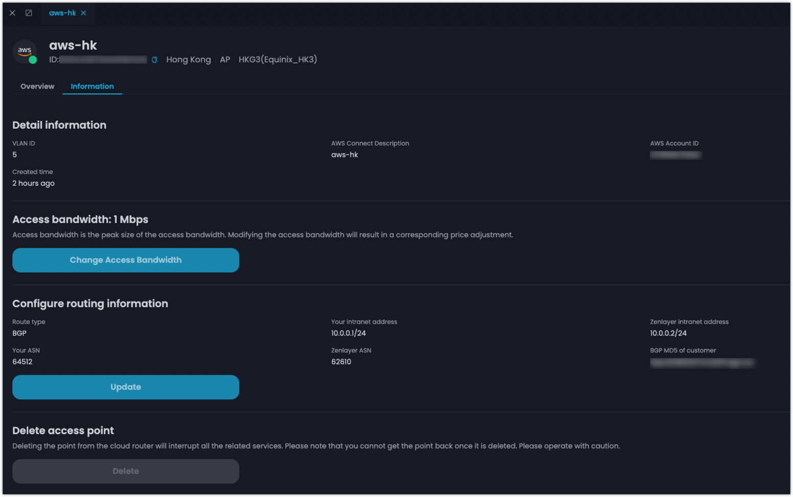
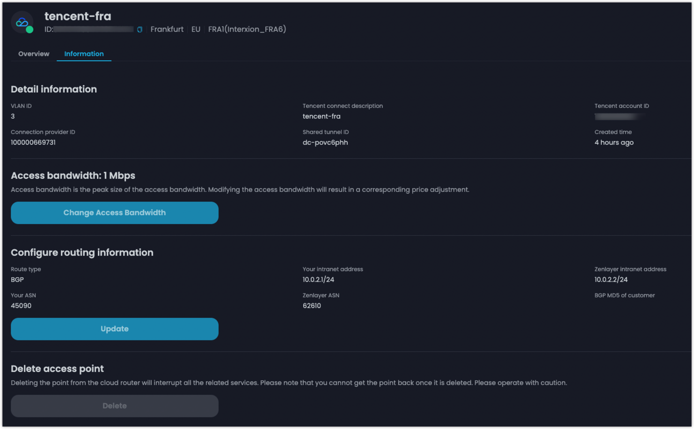
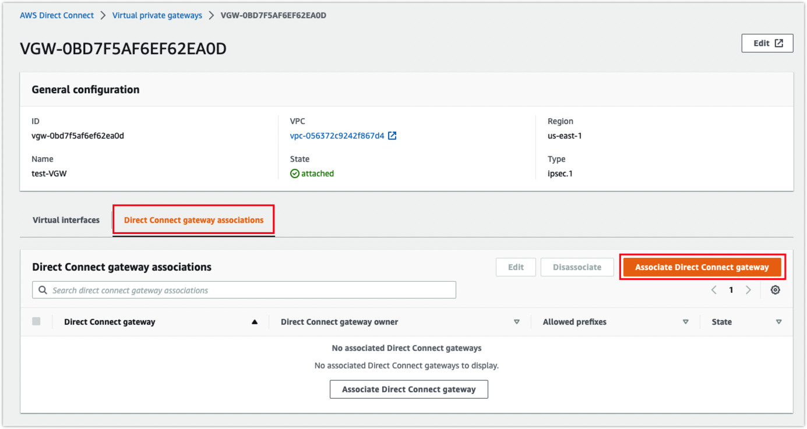
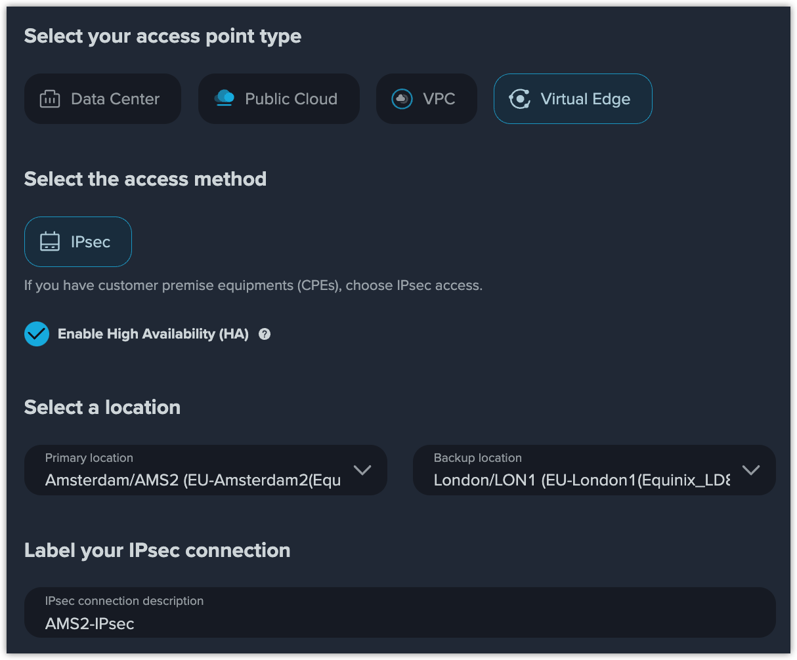

# Create a Multi-cloud Connection in Cloud Networking

Zenlayer's global backbone provides multi public cloud connection to manage your data across cloud service providers such as Amazon Web Services (AWS) and Tencent Cloud. When you need to synchronize or migrate a large amount of data between different clouds, you can choose to create a multi-cloud connection.

## Background Information 

* The Layer 3 network, Cloud Router, is used in the example. The process of Layer 2 network creation is similar. Create the one you desire according to your actual network topology.
* See [**Layer 3 connection**](../get-started/cloud-connection/create-a-layer-3-connection.md) for the basic creation steps. The specific configurations are as follows.

## Procedures 

You create a Cloud Router first on zenConsole, and then validate the connection on public cloud console.

### Add Access Point of AWS 

Assume that you have the AWS services in Hong Kong.

1. Select the access point in Hong Kong, label the connections as aws-hk and enter your AWS account ID.
2. Configure the BGP routing.
   * Your intranet address: `10.0.0.1/24`
   * Zenlayer intranet address: `10.0.0.2/24`
   * Your ASN: The ASN of AWS side, **64512** by default
   * Zenlayer ASN: **62610**
   * BGP MD5: You can customize it or copy the system-generated key by AWS. Just keep sync with the BGP authentication key on AWS.
3. Configure the bandwidth. AWS direct connect provides bandwidth specifications like 50 Mbps, 100 Mbps, 200 Mbps, 300 Mbps, 400 Mbps, 500 Mbps, 1 Gbps, 2 Gbps, 5 Gbps, and 10 Gbps. Your actual access bandwidth will be the larger specification nearest to your configuration.

The final configurations are as follows:

<figure><figcaption>
Configurations of AWS Access Point
</figcaption></figure>

### Add Access Point of Tencent Cloud 

Assume that you have the Tencent Cloud services in Frankfurt.

1. Select the access point in Frankfurt, label the connections as tencent-fra and enter your Tencent Cloud account ID.
2. Configure the BGP routing.
   * Your intranet address: `10.0.2.1/24`
   * Zenlayer intranet address: `10.0.2.2/24`
   * Your ASN: The ASN of Tencent side, **45090** by default
   * Zenlayer ASN: **62610**
   * BGP MD5: You can customize it or keep sync with the BGP authentication key on Tencent Cloud.
3. Configure the bandwidth. Tencent direct connect provides bandwidth specifications like 50 Mbps, 100 Mbps, 200 Mbps, 300 Mbps, 400 Mbps, 500 Mbps, 1 Gbps, 2 Gbps, 5 Gbps, 8 Gbps, 10 Gbps, 40 Gbps, and 100 Gbps. Your actual access bandwidth will be the larger specification nearest to your configuration.

The final configurations are as follows:

<figure><figcaption>
Configurations of Tencent Cloud Access Point
</figcaption></figure>


<mark style="color:blue;">**Note**</mark>

<mark style="color:blue;">Pay attention to the</mark> <mark style="color:blue;"></mark><mark style="color:blue;">**Connection provider ID**</mark> <mark style="color:blue;"></mark><mark style="color:blue;">and</mark> <mark style="color:blue;"></mark><mark style="color:blue;">**Shared tunnel ID**</mark><mark style="color:blue;">, which will be used in configurations on Tencent Cloud.</mark>


### Configurations on the AWS Side 

1.  Go to [**AWS console**](https://console.aws.amazon.com/console/home?nc2=h\_ct\&src=header-signin) > [**Direct Connect**](https://us-east-1.console.aws.amazon.com/directconnect/v2/home?region=us-east-1#/connections). Click **Virtual private gateways** and create a new one, for example, named **test-VGW**. Select the default AWS ASN - **64512**.\

    <figure><figcaption>
Virtual Private Gateway Creation
</figcaption></figure>
2.  Click **Direct Connect gateways**, and create a new one, for example, named **test-DC-VGW**. Enter the default AWS ASN - **64512**.\

    <figure><figcaption>
Direct Connect Gateway Creation
</figcaption></figure>
3.  Click the Virtual private gateway - **test-VGW** you created, go to **Your VPCs** and create a VPC, named **test- VPC**.\

    <figure><figcaption>
VPC Creation
</figcaption></figure>
4.  Attach **test-VGW** to the VPC - **test- VPC**.\

    <figure><figcaption>
VPC Attachment 
</figcaption></figure>
5.  Associate Direct Connect gateway - **test-DC-VGW**.\

    <figure><figcaption></figcaption></figure>

    <figure><figcaption>
Direct Connect Gateway Association
</figcaption></figure>
6.  Go to **Connections**, click the **aws-hk** connection, confirm the information and click **Accept**.\

    <figure><figcaption>
Accept Connection
</figcaption></figure>
7.  Create virtual interface, named **test-hk**.\

    <figure><figcaption></figcaption></figure>

    <figure><figcaption>
Virtual Interface Creation
</figcaption></figure>

    * VLAN: The **VLAN ID** on zenConsole. Here is **5**.
    *   BGP ASN: The ASN of Zenlayer - **62610**

        <figure><figcaption></figcaption></figure>
8.  Click **test-hk** and click **Add peering**.\

    <figure><figcaption></figcaption></figure>

    <figure><figcaption>
Add BGP Peering
</figcaption></figure>

    * BGP ASN: The ASN of Zenlayer - **62610**
    * Amazon router peer IP: **Your intranet address** - `10.0.0.1/24` on zenConsole
    * Your router peer IP: **Zenlayer intranet address** - `10.0.0.2/24` on zenConsole
    *   BGP authentication key: **BGP MD5 of customer** - **123** on zenConsole&#x20;

        <figure><figcaption></figcaption></figure>


<mark style="color:blue;">**Note**</mark>

<mark style="color:blue;">A virtual interface has at least one peering either IPv4 or IPv6. As there was a default IPv4 peering generated when creating the virtual interface -</mark> <mark style="color:blue;"></mark><mark style="color:blue;">**test-hk**</mark><mark style="color:blue;">, you cannot create another IPv4 peering now.</mark>&#x20;

<mark style="color:blue;">You can create an IPv6 peering first and then delete the existing IPv4 one, in order to create the IPv4 peering you need.</mark>


#### **Result**

Wait for several minutes until your AWS direct connect is available and the BGP peering is available and up.

<figure><figcaption>
AWS Direct Connect &#x26; BGP Peering Available
</figcaption></figure>

### Configurations on the Tencent Cloud Side 

1.  Go to [**VPC console**](https://console.tencentcloud.com/vpc), select the region of the VPC, click **+New** to create a VPC, for example, name **test-VPC**.\

    <figure><figcaption>
VPC Creation
</figcaption></figure>
2.  Go to [**Direct Connect**](https://console.tencentcloud.com/dc/dc), click **Direct Connect Gateway**, and click **+ New** to create a direct connect gateway, for example, name **test-GW**. Attach **test-GW** the VPC - **test-VPC**. \

    <figure><figcaption>
Direct Connect Gateway Creation
</figcaption></figure>
3. Go to the [**Direct Connect**](https://console.tencentcloud.com/dc/conn) > **Dedicated Tunnels**, click **+ New** to apply for a shared tunnel, named **test-fra**. Attach **test-fra** to the VPC - **test-VPC** and the direct connect gateway - **test-GW**.
   * Connection provider ID: Zenlayer is the connection provider. Here the ID is **100000669731**.
   * Shared tunnel ID: The ID of the connection instance used to create the shared tunnel, usually started with **dc-**. Here is **dc-povc6phh**.
   * VLAN ID: The VLAN ID on zenConsole. Here is **3**.
   * Bandwidth: The access bandwidth. Here is **1 Mbps**.
   * Tencent Cloud Primary IP: **Your intranet address** - `10.0.2.1/24` on zenConsole.
   * Tencent Cloud Secondary IP: Used to ensure the normal operation of your business when the **Tencent Cloud primary IP** fails and becomes unavailable. Here is `10.0.2.3/24` as an example.
   * CPE Peer IP: **Zenlayer intranet address** - `10.0.2.2/24` on zenConsole.
   * BGP ASN: The ASN of Zenlayer - **62610**
   *   BGP Key: **BGP MD5 of customer** - **456** on zenConsole\

       <figure><figcaption></figcaption></figure>

#### **Result**

Wait for several minutes until your shared dedicated tunnel is connected and the BGP routing is established.

You can check the state in the advanced configuration of the shared dedicated tunnel - **test-fra**.

