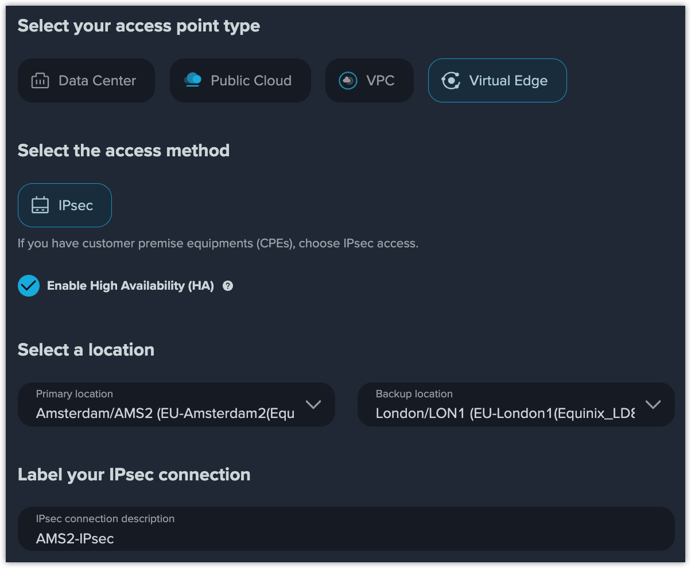

# Select Virtual Edge as Access Point

## Prerequisites

You need to have at least one customer premise equipment (CPE).

## Procedures

****[**Virtual edge**](../../overview/concepts.md#virtual-edge) connection is a cost-effective solution to connect your office far away. The Internet Protocol Security (IPsec) access is supported for now.

<figure><figcaption>
IPsec Connection
</figcaption></figure>

 

<figure><figcaption>
IPsec Connection in HA
</figcaption></figure>

1.  Select the IPsec access method and decide whether to enable high availability (HA) according to your actual needs. \
    High availability (HA) supports both primary and backup access points' configuration to perform a failover, which is is critical to disaster recovery (DR).

    <mark style="color:blue;"></mark><mark style="color:blue;">**Note**</mark>

    * <mark style="color:blue;">The static routing is not supported in HA. IPsec connection in HA only support BGP routing.</mark>
    * <mark style="color:blue;">You need to configure both primary and backup informations, including locations, IPs, if you have enabled HA.</mark>&#x20;
2. Select the location closest to your CPE. If you enable HA, select both primary and backup locations.
3. Label your IPsec connection for identification.

## IPsec Tunnel Configuration

After adding the virtual edge point, go to **Configuration** to configure the IPsec tunnel.

An IPsec tunnel is just like a virtual "tunnel" through a public network between two dedicated routers, enabling safe and secure transmission of data.

<figure><figcaption>
Configure IPsec Tunnel
</figcaption></figure>

Select a mode and enter a pre-shared key (PSK) for negotiation. If you select **Remote IP Address** mode, provide your public remote IP address of your CPE.

### FQDN

A fully qualified domain name (FQDN) is the unique identification of the remote endpoint with which IPsec tunnel negotiations should be allowed.

### Remote IP Address

A public IP address of the remote endpoint with which IPsec tunnel negotiations should be allowed.


<mark style="color:blue;">**Note**</mark>

* <mark style="color:blue;">You're recommended to use</mark> <mark style="color:blue;"></mark><mark style="color:blue;">**FQDN**</mark> <mark style="color:blue;"></mark><mark style="color:blue;">mode because you can have a more dynamic public IP planing.</mark>
* <mark style="color:blue;">If you choose</mark> <mark style="color:blue;"></mark><mark style="color:blue;">**Remote IP Address**</mark> <mark style="color:blue;"></mark><mark style="color:blue;">mode, please ensure the public IP cannot change.</mark>
* <mark style="color:blue;">If you enable HA, both primary and backup PSKs are required.</mark>


## What to Do Next

Configure [**routing**](configure-routing-information.md) and **** [**network**](../create-a-layer-2-connection/configure-network-information.md) to finish the virtual edge point adding.

After creating the cloud router, click the label of IPsec point to view the detailed information. Configure the IPsec and routing information on your CPE.

<figure><figcaption>
Detailed Information of IPsec Point
</figcaption></figure>


<mark style="color:blue;">**Note**</mark>

* <mark style="color:blue;">You'd better choose the</mark> <mark style="color:blue;"></mark><mark style="color:blue;">**Recommended**</mark> <mark style="color:blue;"></mark><mark style="color:blue;">configuration.</mark>
* <mark style="color:blue;">IKEv1 Main is only used for Remote IP negotiation.</mark>


