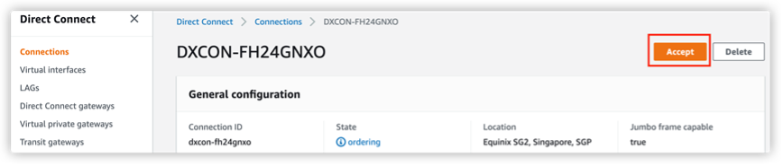

# Validate Connections in Public Cloud

## Amazon Web Service (AWS)

If your public cloud provider is AWS, a few minutes after your connection is created, your AWS account will receive your connection information in the **Direct Connect** > **Connections** list.

<figure><figcaption>
Validate Connection on AWS Console
</figcaption></figure>

1. Click **Accept** to validate your connection.
2. Create a virtual interface and add a BGP peer.\
   Please see [**AWS Documentation**](https://docs.aws.amazon.com/directconnect/latest/UserGuide/create-vif.html) for more details.

## Tencent Cloud

If your public cloud provider is Tencent Cloud, go to Tencent Cloud console.

<figure><figcaption>
Two Kinds of BGP Peering
</figcaption></figure>

1. ****[**Create a VPC**](https://www.tencentcloud.com/document/product/215/31891)****
2. ****[**Create a direct connect gateway**](https://www.tencentcloud.com/document/product/216/19256) and associate the VPC created in previous step
3.  ****[**Apply for a shared tunnel**](https://www.tencentcloud.com/document/product/216/48575)\
    Find the **Connection provider ID** and **Shared tunnel ID** in Tencent Cloud Connection details on zenConsole. \

    <figure><figcaption>
Tencent Cloud Connection Details on zenConsole
</figcaption></figure>

    \
    Fill the **Connection provider ID** and **Shared tunnel ID** into **Basic Configuration** of Shared Dedicated Tunnel creation on Tencent Cloud console, and associate the shared dedicated tunnel to the VPC and gateway created in previous steps.\
    \
    In **Advanced Configuration**, fill the ASN of Tencent Cloud (45090) and ASN of Zenlayer (62610).

## Google Cloud

If your public cloud provider is Google Cloud, you need to [**create a VLAN attachment**](https://cloud.google.com/network-connectivity/docs/interconnect/how-to/partner/creating-vlan-attachments) on Google Cloud console first, generate a pairing key and share it to Zenlayer. See [**Partner Interconnect provisioning**](https://cloud.google.com/network-connectivity/docs/interconnect/how-to/partner/provisioning-overview) for more details. The general steps are listed below.

**On Google Cloud console**

1. Create a VPC.
2. Create a cloud router.
3.  Add VLAN attachment and generate a pairing key.

    <figure><figcaption></figcaption></figure>

**On Zenlayer console**

Use the pairing key generated on Google Cloud to create cloud connect.

* [Layer 2 connection](create-a-layer-2-connection/select-a-public-cloud-as-access-point.md)
* [Layer 3 connection](create-a-layer-3-connection/select-a-public-cloud-as-access-point.md)

****

**Go back to Google Cloud**

[Active the cloud connection](https://cloud.google.com/network-connectivity/docs/interconnect/how-to/partner/activating-connections).

<figure><figcaption></figcaption></figure>

