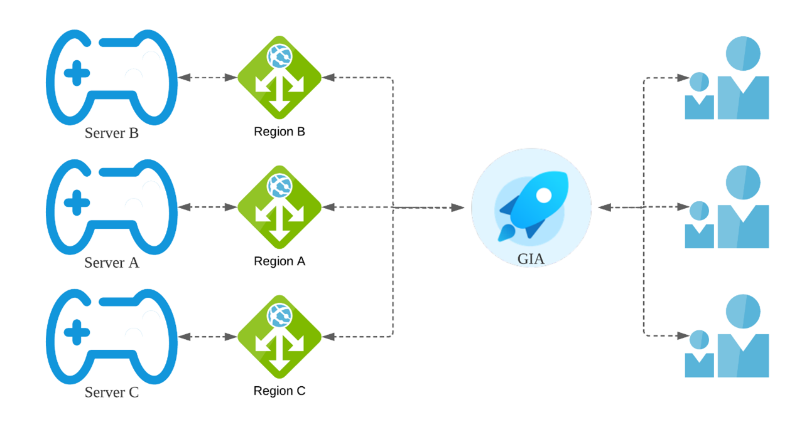

# Case Study

<figure><figcaption></figcaption></figure>

#### 1. Online Gaming

\
Challenge: The customer is a global online mobile game provider that needed to improve the user experience for its worldwide users. The client uses CDN for game package downloads and distributes its battle servers to reduce user delay in various regions. However, some services must be returned to the origin server for processing like user identification and virtual item trading. This causes information synchronization problems and affects the user experience. \
\
Solution: The customer's origin server is in Frankfurt. Before using ZGA, the delay for users in Singapore and Indonesia was as high as 600 ms and players often got stuck in the login and checkout interface. Now with ZGA, Asian users can access the nearest Zenlayer node through Cname. The players experience the game as if the origin server is in their own city, and the delay is reduced to 10 ms with 0 packet loss. The game interface login is much smoother, and payment processing takes place instantly.\

<figure><figcaption></figcaption></figure>

#### 2. Blockchain

\
Challenge: Digital blockchain-based trading is much different from traditional stock and bond trading. The market operates around the clock, and transactions take place in real-time over the internet.Network speed can make or break a transaction, which is why buyers and sellers are very picky when choosing an exchange. \
\
At first, the customer's exchange website was mainly for domestic users. But over time, buyers and sellers from other regions started to register as users. The high-latency network made it difficult for users in these regions to complete a transaction successfully.\
\
Solution: By using ZGA, the delay for users to access the exchange was reduced to less than 20ms. As a result, the website is now receiving better reviews and attracting more users.\
\
\

#### 3. Corporate Business Operation

\
Challenge: The customer is a traditional manufacturing company running a global sales and service operation over a unified SaaS platform. The company's IT department spent a lot of time and capital working with local network providers to support its global operations.  However, the organization was still experiencing poor network conditions, resulting in customer complaints, and reduced operational efficiency. \
\
Solution: ZGA eliminates the need to connect to different dedicated regional network providers. Now, the company enjoys seamless global connectivity. In addition, ZGA removes the need to configure and maintain networking equipment. ZGA saves the company a significant amount of resources and helps avoid customer complaints.  \
\
