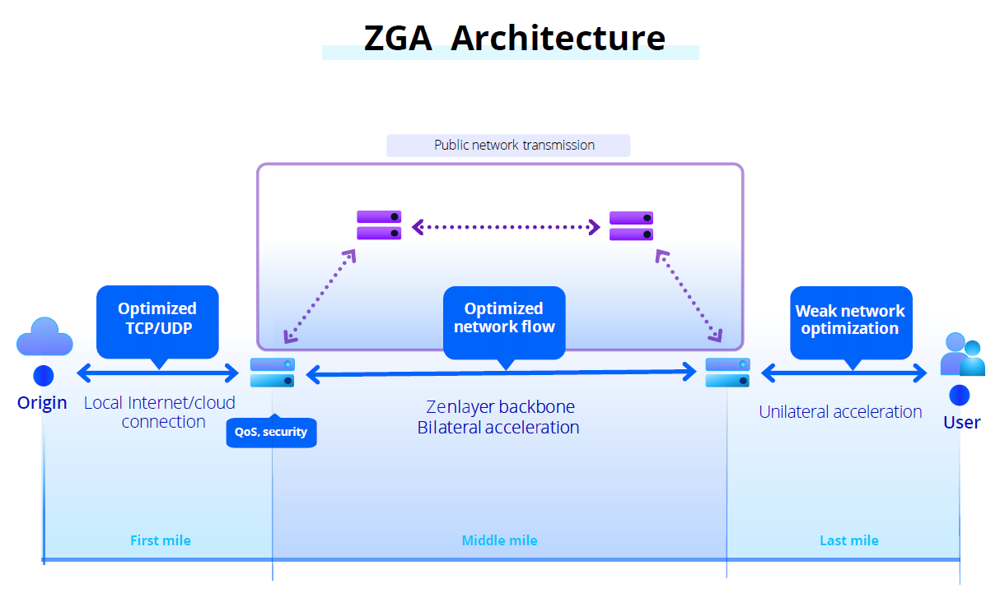

# Overview

Global corporations today face a variety of challenges when connecting distributed users to websites, platforms, and applications. Common issues include poor application performance, slow synchronization across regional cloud servers, and interruptions during cross-border downloads.\
\
Zenlayer Global Accelerator (ZGA) is a network acceleration service built on Zenlayer's massive global private infrastructure. It improves application performance by enabling access to the origin server through a high-speed connection from the nearest node, greatly reducing jitters, latency and packet loss.\
\
ZGA provides stable and secure connectivity to global applications, improves user experience, and reduce operational costs. ZGA makes life easier for network operators, DevOps & IT pros, by automating connectivity to global resources.\
&#x20;

#### Architecture Overview

Most global organizations are relying on the public internet for cross-border content sharing and application delivery. Yet, the public internet is slow, insecure, and unreliable. ZGA serves as a fast lane for global connectivity, as an alternative to the public internet.\
\
Most companies offering network acceleration today provide middle mile acceleration between two PoPs. ZGA goes a step beyond, providing intelligent end-to-end acceleration, across the first, middle, and last mile for a much more comprehensive level of support.\
\
First Mile: Zenlayer provides cloud direct connections to the public cloud.\
\
Middle Mile: ZGA uses the Zenlayer software defined networking (SDN) backbone and protocol optimization for lightning-fast acceleration between PoP sites.\
\
Last Mile: ZGA detects the user’s access area using smart DNS and provides access to the nearest local ZGA PoP.

<figure><figcaption></figcaption></figure>

