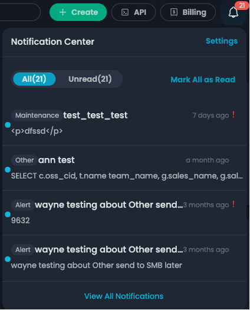

# Notification Center

Hover over .jpg>) on the upper right corner of the zenConsole to view your notifications. Click **View All Notifications** to view more details.

<figure><figcaption>
Notification Center
</figcaption></figure>

* Select one or more notifications and click on **Mark as Read** to hide notification badges. You can click on **Mark All as Read** to hide all notification badges.
* Click on **Delete** to delete a notification.
* Click on **Settings** to enable or disable specific notifications and the associated email notifications.

